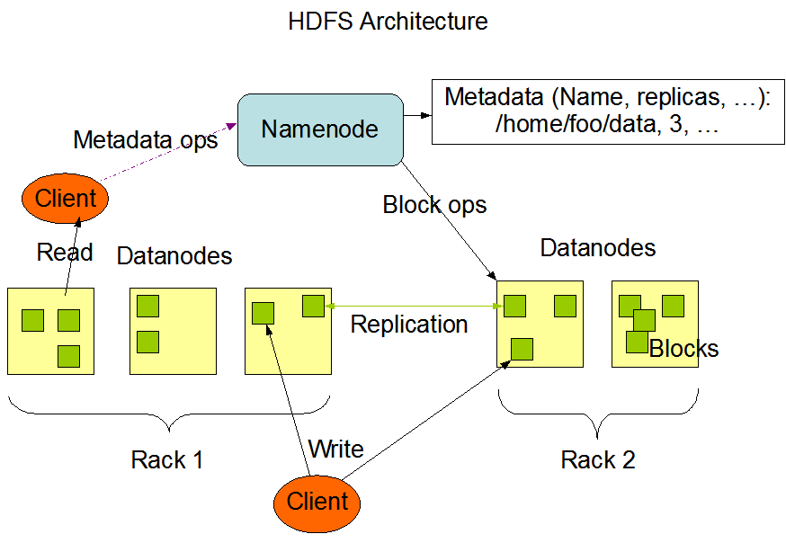
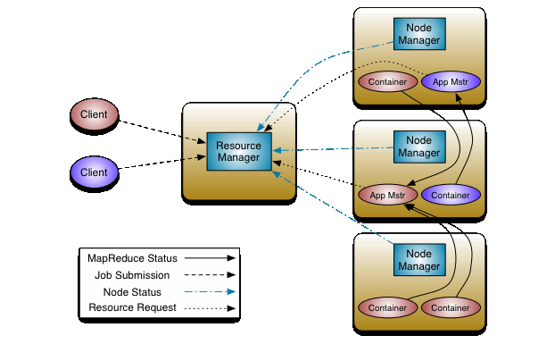

# Hadoop

## 组件介绍

### HDFS

Hadoop 分布式文件系统，HDFS 是具有高容错性高吞吐性的文件系统，并且可以部署在低成本的硬件之上



- NameNode: 管理文件系统元数据

- SecondaryNameNode：每隔一段时间对NameNode元数据进行备份

- DataNode：管理文件系统块和副本

### Yarn

全局资源调度器，负责将集群任务调度到计算节点


- ResourceManager：集群资源调度

- NodeManager：单个节点资源调度

### MapReduce

分布式计算框架，负责拆分任务并最终汇总数据

## 准备工作

```shell
# node-[1:3]
yum install -y jdk-8u191-linux-x64.rpm
useradd app
mkdir /data /opt/apps
chown app /data /opt/apps
echo -e "192.168.1.1 node-1\n192.168.1.2 node-2\n192.168.1.3 node-3" >>/etc/hosts

# node-1
su app
ssh-keygen
ssh-copy-id node-1
ssh-copy-id node-2
ssh-copy-id node-3

cd /opt/apps
wget https://dlcdn.apache.org/hadoop/common/hadoop-3.3.4/hadoop-3.3.4.tar.gz
scp hadoop-3.3.4.tar.gz node-2:/opt/apps
scp hadoop-3.3.4.tar.gz node-3:/opt/apps

# node-[1:3]
tar -zvxf hadoop-3.3.4.tar.gz
mv hadoop-3.3.4 hadoop
```

## 分布式部署

| 主机名 | 部署组件 |
| - | - |
| node-1 | DataNode NameNode SecondaryNameNode ResourceManager NodeManager
| node-2 | DataNode NodeManager
| node-3 | DataNode NodeManager

### 配置文件

#### hadoop-common

etc/hadoop/core-site.xml

```xml
<?xml version="1.0" encoding="UTF-8"?>
<configuration>
    <property>
        <!-- WebUI 用户 -->
        <name>hadoop.http.staticuser.user</name>
        <value>app</value>
    </property>
    <property>
        <!-- node 节点配置 -->
        <name>fs.defaultFS</name>
        <value>hdfs://node-1:9000</value>
    </property>
    <property>
        <!-- 临时数据 -->
        <name>hadoop.tmp.dir</name>
        <value>/data/hdfs/tmp</value>
    </property>
</configuration>
```

#### HDFS

etc/hadoop/hdfs-site.xml

```xml
<?xml version="1.0" encoding="UTF-8"?>
<configuration>
    <property>
        <!-- fs 副本数   -->
        <name>dfs.replication</name>
        <value>2</value>
    </property>
    <property>
        <!-- 数据存储目录   -->
        <name>dfs.data.dir</name>
        <value>file:///data/hadoop/data</value>
    </property>
    <property>
        <!-- name空间存储目录   -->
        <name>dfs.name.dir</name>
        <value>file:///data/hadoop/name</value>
    </property>
</configuration>
```

#### Yarn

etc/hadoop/yarn-site.xml

```xml
<?xml version="1.0" encoding="UTF-8"?>
<configuration>
    <property>
         <!-- Yarn提供的服务列表   -->
         <name>yarn.nodemanager.aux-services</name>
         <value>mapreduce_shuffle</value>
    </property>
    <property>
        <!--  ResourceManager配置  -->
        <name>yarn.resourcemanager.hostname</name>
        <value>node-1</value>
    </property>
</configuration>

```

#### MapReduce

etc/hadoop/mapred-site.xml

```xml
<?xml version="1.0" encoding="UTF-8"?>
<configuration>
    <property>
        <!--  配置调度框架为Yarn  -->
        <name>mapreduce.framework.name</name>
        <value>yarn</value>
    </property>
</configuration>

```

#### 配置环境变量

etc/hadoop/hadoop-env.sh

```shell
export JAVA_HOME=/usr/java/default
export HADOOP_LOG_DIR=/data/logs/hadoop
```

etc/hadoop/yarn-env.sh

```shell
export JAVA_HOME=/usr/java/default
```

hadoop/mapred-env.sh

```shell
export JAVA_HOME=/usr/java/default
```

#### 配置slave节点

etc/hadoop/workers

```shell
node-1
node-2
node-3
```

#### 同步配置文件

```shell
# node-1 
scp -r etc node-2:/opt/apps/hadoop/
scp -r etc node-3:/opt/apps/hadoop/
```

### 启动集群

```shell
# 首次启动需要初始化NameNode数据
./bin/hadoop namenode -format

# 启动HDFS
./sbin/start-dfs.sh

# 启动Yarn
./sbin/start-yarn.sh
```

### WebUI 地址

<http://node-1:8088/> ResourceManager
<http://node-1:8042/> NodeManager

<http://node-1:9864/> DataNode
<http://node-1:9868/> SecondaryNameNode
<http://node-1:9870/> NameNode

## 高可用部署

| 主机名 | 部署组件 |
| - | - |
| node-1 | DataNode NodeManager NameNode ResourceManager SecondaryNameNode
| node-2 | DataNode NodeManager NameNode ResourceManager SecondaryNameNode
| node-3 | DataNode NodeManager NameNode ResourceManager SecondaryNameNode

### ZK集群配置

### 准备工作

```shell
# app@node-1
cd /opt/apps
wget https://dlcdn.apache.org/zookeeper/zookeeper-3.8.0/apache-zookeeper-3.8.0-bin.tar.gz
scp apache-zookeeper-3.8.0-bin.tar.gz node-2:/opt/apps
scp apache-zookeeper-3.8.0-bin.tar.gz node-3:/opt/apps

# app@node-[1:3]
tar -zvxf apache-zookeeper-3.8.0-bin.tar.gz
mv apache-zookeeper-3.8.0-bin zookeeper
mkdir /data/zk

# app@node-1
echo 1 >/data/zk/myid

# app@node-2
echo 2 >/data/zk/myid

# app@node-3
echo 3 >/data/zk/myid
```

#### 配置文件

conf/zoo.cfg

```shell
tickTime=2000
initLimit=10
syncLimit=5
dataDir=/data/zk
clientPort=2181
server.1=node-1:2888:3888
server.2=node-2:2888:3888
server.3=node-3:2888:3888

```

#### 启动集群

```shell
# app@node-[1:3]
cd /opt/apps/zookeeper/bin
./zkServer.sh start
```

### 配置文件

#### hadoop-common

etc/hadoop/core-site.xml

```xml
<?xml version="1.0" encoding="UTF-8"?>
<configuration>
    <property>
        <!-- WebUI用户 -->
        <name>hadoop.http.staticuser.user</name>
        <value>app</value>
    </property>
    <property>
        <!-- 默认文件系统 -->
        <name>fs.defaultFS</name>
        <!-- HA配置: 指向nameservices ID -->
        <value>hdfs://ns-cluster1</value>
    </property>
    <property>
        <!-- 临时数据 -->
        <name>hadoop.tmp.dir</name>
        <value>/data/hadoop/tmp</value>
    </property>
    <property>
        <!-- HA配置: zk集群配置 -->
        <name>ha.zookeeper.quorum</name>
        <value>node-1:2181,node-2:2181,node-3:2181</value>
    </property>
</configuration>

```

#### HDFS

etc/hadoop/hdfs-site.xml

```xml
<?xml version="1.0" encoding="UTF-8"?>
<configuration>
    <property>
        <!-- fs 副本数   -->
        <name>dfs.replication</name>
        <value>2</value>
    </property>
    <property>
        <!-- 数据存储目录   -->
        <name>dfs.data.dir</name>
        <value>file:///data/hadoop/data</value>
    </property>
    <property>
        <!-- name空间存储目录   -->
        <name>dfs.namenode.name.dir</name>
        <value>file:///data/hadoop/name</value>
    </property>
    <property>
        <!-- HA配置: nameservices ID   -->
        <name>dfs.nameservices</name>
        <value>ns-cluster1</value>
    </property>
    <property>
        <!-- HA配置: nameservices 包含的NameNode ID   -->
        <name>dfs.ha.namenodes.ns-cluster1</name>
        <value>nn1,nn2,nn3</value>
    </property>
    <!-- HA配置: NameNode RPC地址   -->
    <property>
        <name>dfs.namenode.rpc-address.ns-cluster1.nn1</name>
        <value>node-1:8020</value>
    </property>
    <property>
        <name>dfs.namenode.rpc-address.ns-cluster1.nn2</name>
        <value>node-2:8020</value>
    </property>
    <property>
        <name>dfs.namenode.rpc-address.ns-cluster1.nn3</name>
        <value>node-3:8020</value>
    </property>
    <!-- HA配置: NameNode HTTP地址   -->
    <property>
        <name>dfs.namenode.http-address.ns-cluster1.nn1</name>
        <value>node-1:9870</value>
    </property>
    <property>
        <name>dfs.namenode.http-address.ns-cluster1.nn2</name>
        <value>node-2:9870</value>
    </property>
    <property>
        <name>dfs.namenode.http-address.ns-cluster1.nn3</name>
        <value>node-3:9870</value>
    </property>
    <property>
        <!-- HA配置: NameNode存储事务目录   -->
        <name>dfs.namenode.edits.dir</name>
        <value>file:///data/hadoop/edits</value>
    </property>
    <property>
        <!-- HA配置: JournalNode存储目录   -->
        <name>dfs.journalnode.edits.dir</name>
        <value>/data/hadoop/journal</value>
    </property>
    <property>
        <!-- HA配置: JournalNode共享目录地址   -->
        <name>dfs.namenode.shared.edits.dir</name>
        <value>qjournal://node-1:8485;node-2:8485;node-3:8485/ns-cluster1</value>
    </property>
    <property>
        <!-- HA配置: 故障转移模式   -->
        <name>dfs.ha.fencing.methods</name>
        <value>shell(/bin/true)</value>
    </property>
    <property>
        <!-- HA配置: 开启故障转移   -->
        <name>dfs.ha.automatic-failover.enabled</name>
        <value>true</value>
    </property>
    <property>
        <!-- HA配置: 故障转移提供者   -->
        <name>dfs.client.failover.proxy.provider.ns-cluster1</name>
        <value>>org.apache.hadoop.hdfs.server.namenode.ha.ConfiguredFailoverProxyProvider</value>
    </property>
</configuration>
```

#### Yarn

etc/hadoop/yarn-site.xml

```xml
<?xml version="1.0" encoding="UTF-8"?>
<configuration>
    <property>
        <!-- Yarn提供的服务列表   -->
        <name>yarn.nodemanager.aux-services</name>
        <value>mapreduce_shuffle</value>
    </property>
    <property>
        <!-- HA配置: 开启HA   -->
        <name>yarn.resourcemanager.ha.enabled</name>
        <value>true</value>
    </property>
    <property>
        <!-- HA配置: ResourceManager集群ID   -->
        <name>yarn.resourcemanager.cluster-id</name>
        <value>rm-cluster1</value>
    </property>
    <property>
        <!-- HA配置: ResourceManager集群成员   -->
        <name>yarn.resourcemanager.ha.rm-ids</name>
        <value>rm1,rm2,rm3</value>
    </property>
    <!-- HA配置: ResourceManager 主机名   -->
    <property>
        <name>yarn.resourcemanager.hostname.rm1</name>
        <value>node-1</value>
    </property>
    <property>
        <name>yarn.resourcemanager.hostname.rm2</name>
        <value>node-2</value>
    </property>
    <property>
        <name>yarn.resourcemanager.hostname.rm3</name>
        <value>node-3</value>
    </property>
    <!-- HA配置: ResourceManager 地址   -->
    <property>
        <name>yarn.resourcemanager.webapp.address.rm1</name>
        <value>node-1:8088</value>
    </property>
    <property>
        <name>yarn.resourcemanager.webapp.address.rm2</name>
        <value>node-2:8088</value>
    </property>
    <property>
        <name>yarn.resourcemanager.webapp.address.rm3</name>
        <value>node-3:8088</value>
    </property>
    <property>
        <!-- HA配置: zk集群配置 -->
        <name>hadoop.zk.address</name>
        <value>node-1:2181,node-2:2181,node-3:2181</value>
    </property>
</configuration>
```

#### MapReduce

etc/hadoop/mapred-site.xml

```xml
<?xml version="1.0" encoding="UTF-8"?>
<configuration>
    <property>
        <!--  配置调度框架为Yarn  -->
        <name>mapreduce.framework.name</name>
        <value>yarn</value>
    </property>
</configuration>

```

#### 配置环境变量

etc/hadoop/hadoop-env.sh

```shell
export JAVA_HOME=/usr/java/default
export HADOOP_LOG_DIR=/data/logs/hadoop
```

etc/hadoop/yarn-env.sh

```shell
export JAVA_HOME=/usr/java/default
```

hadoop/mapred-env.sh

```shell
export JAVA_HOME=/usr/java/default
```

#### 配置slave节点

etc/hadoop/workers

```shell
node-1
node-2
node-3
```

#### 同步配置文件

```shell
# node-1 
scp -r etc node-2:/opt/apps/hadoop/
scp -r etc node-3:/opt/apps/hadoop/
```

### 启动HDFS

```shell
# app@node-[1:3]
./bin/hdfs --daemon start journalnode

# app@node-1
# 首次启动需要初始化NameNode和ZKFC数据 并且同步初始化数据
./bin/hdfs zkfc -formatZK
./bin/hadoop namenode -format
 scp -r /data/hadoop/name/ node-2:/data/hadoop/
 scp -r /data/hadoop/edits/ node-2:/data/hadoop/
 scp -r /data/hadoop/name/ node-3:/data/hadoop/
 scp -r /data/hadoop/edits/ node-3:/data/hadoop/
./sbin/start-dfs.sh
```

```shell
# 查看HA状态
./bin/hdfs haadmin -ns ns-cluster1 -getAllServiceState
node-1:8020                                        active    
node-2:8020                                        standby   
node-3:8020                                        standby  
```

### 启动HDFS

```shell
# app@node-[1:3]
./bin/hdfs --daemon start journalnode

# app@node-1
# 首次启动需要初始化NameNode和ZKFC数据 并且同步初始化数据
./bin/hdfs zkfc -formatZK
./bin/hadoop namenode -format
 scp -r /data/hadoop/name/ node-2:/data/hadoop/
 scp -r /data/hadoop/edits/ node-2:/data/hadoop/
 scp -r /data/hadoop/name/ node-3:/data/hadoop/
 scp -r /data/hadoop/edits/ node-3:/data/hadoop/
./sbin/start-dfs.sh
```

```shell
# 查看HA状态
./bin/hdfs haadmin -ns ns-cluster1 -getAllServiceState
node-1:8020                                        active    
node-2:8020                                        standby   
node-3:8020                                        standby  
```

### 启动YARN

```shell
# app@node-1
./sbin/start-yarn.sh
```

```shell
# 查看HA状态
./bin/yarn rmadmin -getAllServiceState
node-1:8033                                        standby   
node-2:8033                                        active    
node-3:8033                                        standby 
```
