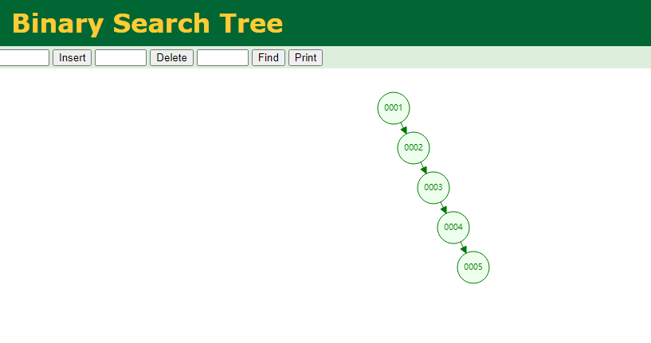

# 数据结构

## 二叉树

### 特点

- 任意节点左子树不为空,则左子树的值均小于根节点的值
- 任意节点右子树不为空,则右子树的值均大于于根节点的值
- 任意节点的左右子树也分别是二叉查找树
- 没有键值相等的节点

### 适用场景

- 实际几乎没有应用场景

## 二叉平衡书

### 特点

- 左右子树的高度差不超过1

### 适用场景

- 插入和删除需要频繁的回旋平衡左右子树，频繁读取的场景

## 红黑树

### 特点

- 节点非黑即红
- 根节点是黑色的
- 叶子节点是黑色的，并且为null
- 没有相邻的红色节点
- 从任意节点出发到达叶子节点中包含相同数量的黑色节点
- 新加入的节点是红色节点
- 所有节点深度不大于最小深度节点的2倍

### 适用场景

- 适用于插入删除频繁的场景

## B-树

### 特点

- 一个m阶的树，每个节点最多有m个子节点（m=Max. Degree）
- 每个节点都存储了键值和数据
- 每个节点可以存储m-1个键值和数据
- 非叶子根节点至少有m/2个子节点

### 适用场景

- B-树深度相对二叉树较低，比较适合对I/O次数敏感的文件系统索引场景

## B+树

### 特点

- 非叶节点只存储键值，叶子节点存储数据
- 叶子节点有指针指向其右侧叶子节点（单向链表），或有双向指针指向其左右侧叶子节点（双向链表）

### 适用场景

- B+树非叶子节点不存储数据，并且叶子节点适用链表关联，一次I/O 能够查询更多的数据，范围查询性能也更好

