# 云原生

## 容器理论

### 容器概念

容器是一个标准的软件运行单元，有以下特点：

- 环境隔离
- 简单轻量
- 可移植

如果要实现以上特性需要Linux 内核的 `Cgroup` 和 `Namespace` 技术

### Cgroups

cgroups 是 Linux 内核提供的一种可以限制、记录、隔离进程组所使用的物理资源（内存 CPU I/O 等）的一种机制  

#### Cgroups 的功能

- 资源限制  
比如CPU使用时长和内存使用量进行限制
- 优先级分配
通过给不同进程分配不同的CPU时间片段，实际是就是在给进程设置优先级  
- 资源记录  
统计系统的资源使用量，比如CPU使用时间和内存使用量  
- 任务控制  
cgroups 可以对任务执行挂起、恢复等操作

#### Cgroups 概念

- 任务 `task`  
在 Cgroup 中，任务就是系统的一个进程
- 控制族群 `cgroup`  
控制族群就是一组按某种标准划分的进程，cgroups 中的资源控制都是以控制族群为单位实现  
一个进程加入进程组后，也就享受cgroups 为控制族群分配的资源，同样也受到控制族群资源的限制
- 层级 `hierarchy`  
控制族群可以组织成分层的形式，既一颗控制族群树  
控制族群树上级是父节点，下级是子节点，子节点继承父节点的资源和限制
- 子系统 `subsystem`  
一个子系统就是一个资源控制器，比如CPU子系统，就是控制分配CPU时间片段的控制器

#### Cgroups 子系统

- `blkio`       对块设备的 I/O 进行限制
- `cpu`         限制 CPU 时间片的分配，与 cpuacct 挂载在同一目录
- `cpuacct`     生成 cgroup 中的任务占用 CPU 资源的报告，与 cpu 挂载在同一目录
- `cpuset`      给 cgroup 中的任务分配独立的 CPU（多CPU系统）和内存节点
- `devices`     允许/禁止 cgroup 中的任务访问设备
- `freezer`     暂停/恢复 cgroup 中的任务
- `hugetlb`     限制使用的内存页数量
- `memory`      对 cgroup 中的任务的可用内存进行限制，并自动生成资源占用报告
- `net_cls`     使用等级识别符（classid）标记网络数据包，这让 Linux 流量控制器（tc 指令）可以识别来自特定 cgroup 任务的数据包，并进行网络限制。
- `net_prio`    允许基于 cgroup 设置网络流量(netowork traffic)的优先级。
- `perf_event`  允许使用 perf 工具来监控 cgroup。
- `pids`        限制任务的数量

#### Cgroups 相互关系

- `cgroup` 结构体可以组织成一颗树的形式，每一棵 `cgroup` 结构体组成的树称之为一个`cgroups` 层级结构。每次在系统中创建新层级时，层级的默认 `cgroup` 我们称之为 `root cgroup`，`root cgroup` 在创建层级时自动创建，后面创建的 `cgroup` 是 `root cgroup` 的后代
- 层结构级可以 `attach` 多个 `cgroups` 子系统，每一个 cgroups 子系统只能 `attach` 同一层
- 每一个进程的描述符中有一个指针指向了一个辅助数据结构 `css_set`，指向某一个 `css_set`的进程会被加入到当前 `css_set` 的进程链表中。一个进程只能隶属于一个 `css_set` ， 一个`css_set` 可以包含多个进程，隶属于同一 `css_set` 的进程受到同一个 `css_set` 所关联的资源限制，`css_set` 不能同时关联一个层级结构的多个 `cgroup`
- 如果一个 `css_set` 关联多个层级结构，那表示 `css_set` 下的进程有多个资源限制  
一个 `cgroup` 节点关联了多个 `css_set` ，那表示多个 `css_set` 下的进程受到了同一个资源限制

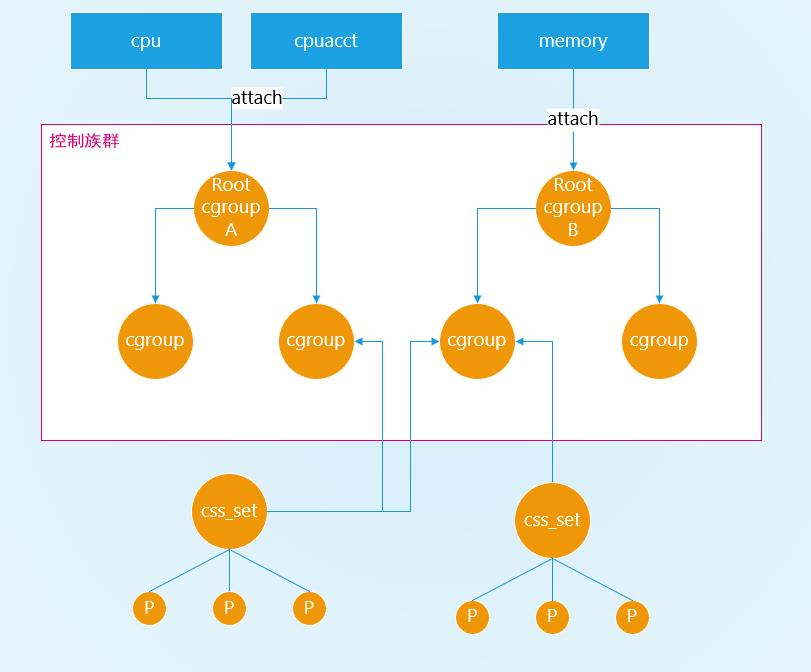

#### Cgroups 实践

- **写一个循环代码**  
运行后可以看到python进程导致了一个CPU核心使用率达到100%

```python
while True:
    continue
```

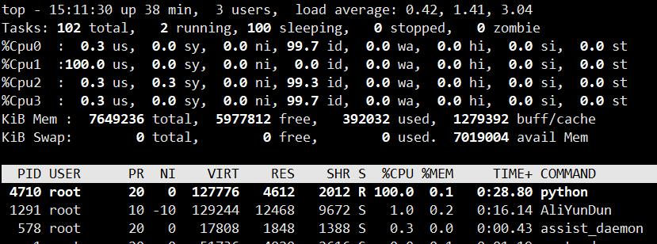

- **创建控制组**  

```shell
mkdir /sys/fs/cgroup/cpu/cpu_test
```

- **限制CPU使用率**  

```shell
cd /sys/fs/cgroup/cpu/cpu_test
echo 20000 > cpu.cfs_quota_us
echo 4710 > tasks
```

默认情况下会把进程的CPU时间片段分成100000份，份数在 `cpu.cfs_period_us` 中设置
`cpu.cfs_quota_us` 是限制进程可以使用的时间份数，默认是-1表示不限制，刚才设置成了20000 所以现象是CPU使用率下降到了20%  

- **查看进程关联的cgroup**

```shell
cat /proc/4710/cgroup

11:memory:/
10:cpuset:/
9:cpuacct,cpu:/cpu_test  # 可以看出来关联了“cpu_test” 控制组
8:blkio:/
7:net_prio,net_cls:/
6:freezer:/
5:perf_event:/
4:hugetlb:/
3:devices:/
2:pids:/
1:name=systemd:/user.slice/user-0.slice/session-14.scope

```

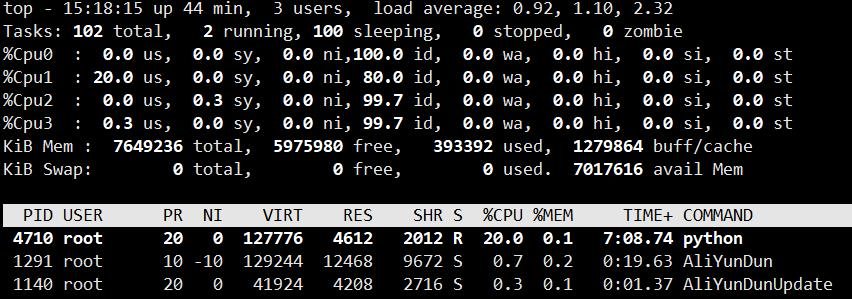

### Namespace

namespace 是将内核的全局资源做封装，使得每个 namespace 都有一份独立的资源，因此不同的进程在各自的 namespace 内对同一种资源的使用不会互相干扰  

#### Namespace 实现原理

资源的隔离 Linux 内核提供了三个系统调用：

- `clone()`  用来创建一个新的进程，并可以通过设计达到隔离
- `unshare()` 使某进程脱离某个namespace
- `setns()` 把某进程加入到某个namespace

#### Namespace 的类型

Linux 目前提供了多种命名空间，这些命名空间基本包含了一个小型操作系统运行所需要的元素

- `UTS` 隔离 hostname、domain
- `PID` 隔离进程
- `IPC` 隔离进程通信
- `Mount` 隔离文件系统
- `Network` 隔离网络资源，比如IP地址和端口
- `User` 隔离了用户系统所需的相关资源，比如 `user id`
- `Time` 隔离时间
- `Cgroup` 隔离cgroup

## Docker

Docker 是一个开源的容器引擎，借助docker 可以轻松的管理容器，构建镜像，在容器中开发应用，用户不必关心复杂的技术细节  
Docker几乎是容器的代名词，但是它并不等于容器，它是帮我们进行容器开发的一套解决方案

### Docker 组件

- `dockerd` 负责创建、运行、监控容器，构建、存储镜像，并提供这些功能的接口
- `docker-cli` 用户命令行工具负责对接docker-daemon接口，实现具体的工作
- `containerd`  容器运行时，dockerd 通过 RPC 调用  containerd 创建多个 containerd-shim 进程
- `containerd-shim` 调用 runC 命令行创建容器
- `runC`  runC 是标准化工具，根据 `OCI` 标准来创建和运行容器
- `OCI` 容器运行时标准 (runtime spec) 和容器镜像标准(image spec)

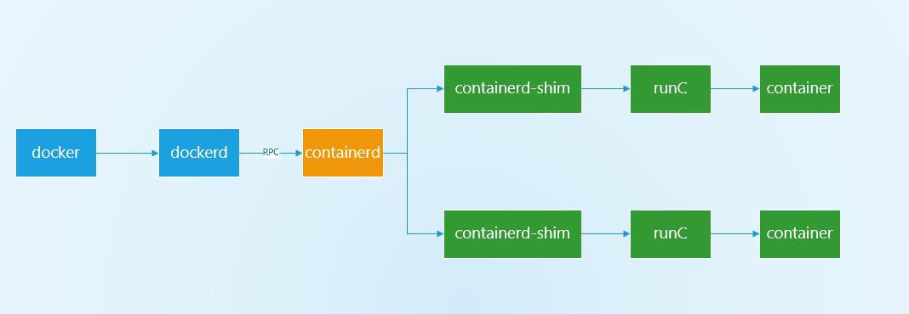

### Docker 网络模式

- `host` 容器和宿主机共享Network namespace
- `container` 容器加入另外一个的容器的Network namespace
- `none` 不提供网络
- `bridge` 默认模式，容器网卡桥接到网桥  `docker0` ,容器和外部网络联系，由宿主机上的NA提供支持

### Docker 文件系统

#### 镜像

docker 镜像是一个程序运行的自包含 `root` 文件系统，它包含了程序运行所需要文件、环境变量、库、配置等  

联合文件系统（UnionFS）是一种分层、轻量级并且高性能的文件系统，它支持对文件系统的修改作为一次提交来一层层的叠加，同时可以将不同目录挂载到同一个虚拟文件系统下

镜像是由多层文件组成的 `AUFS` 联合文件系统，镜像构建时是一层一层叠加的，每一层构建好就变成只读状态，上层的修改不会影响到下层

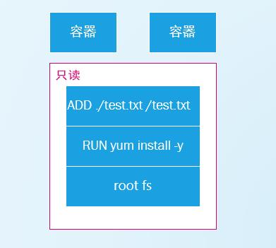

#### AUFS

- `LowerDir` 只读层，镜像包含的文件系统
- `UpperDir` 读写层，容器运行后文件的变化
- `MergedDir` 合并 `LowerDir` `UpperDir`，容器运行后用户视图看到的文件系统

## Kubernetes

Kubernetes 是用于自动部署，扩展和管理容器化应用程序的开源系统。
它将组成应用程序的容器组合成逻辑单元，以便于管理和服务发现。Kubernetes 源自Google 15 年生产环境的运维经验（Google 的Borg系统），同时凝聚了社区的最佳创意和实践。

容器已经成了软件交付的标准，Kubernetes是目前容器编排的事实标准

### Kubernetes 组件

- `API server` 处理api请求，其它组件只和 API server 通信
- `etcd` 存储集群状态和配置，是 API server 的数据库
- `Controller-manage` 一系列控制器的集合
- `Scheduler` 负责 `Pod` 的调度
- `kubelet` 运行在 `worker` 节点，负责对接容器运行时，管理容器的生命周期、容器网络、容器存储
- `kube-proxy` 运行在  `worker` 节点 负责管理 `Service` 实现负载均衡和服务发现

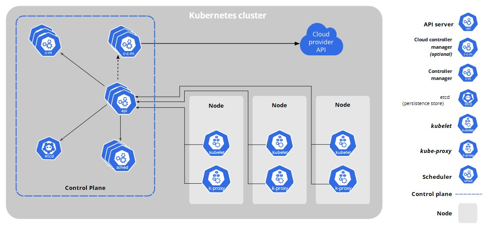

### Kubernetes 通信机制

#### List-Watch

List-Watch 机制可以说是 k8s 架构设计的精髓，它解决了 k8s 内部通信的消息可靠性，消息实时性,消息顺序性和高性能  

- `List API`  
使用 HTTP 短连，可以罗列出一类资源的的全量信息
- `Watch API`  
需要建立一个 HTTP 长连接持续监听资源变化，一旦资源有变化 API server 会主动推送给客户端

我们可以使用 `List API` 全量获取资源信息，接着使用 `Watch API` 监听资源的变化，实现`高性能`和`消息实时性`、`消息顺序性`。  
`Watch API` 断开后，再使用 `List API` 全量获取资源信息保证`消息可靠性`

#### Informer

如果 k8s 内部通信单纯靠 `List-Watch` 是无法满足复杂的业务需求的。实际上 k8s 内部组件使用 `Informer` 机制通信，`Informer` 封装了 `List-Watch`，并提供了`二级缓存` `消息队列` 等重要特性

在 `Golang` 中 `client-go` 包具体实现了 `Informer` 机制

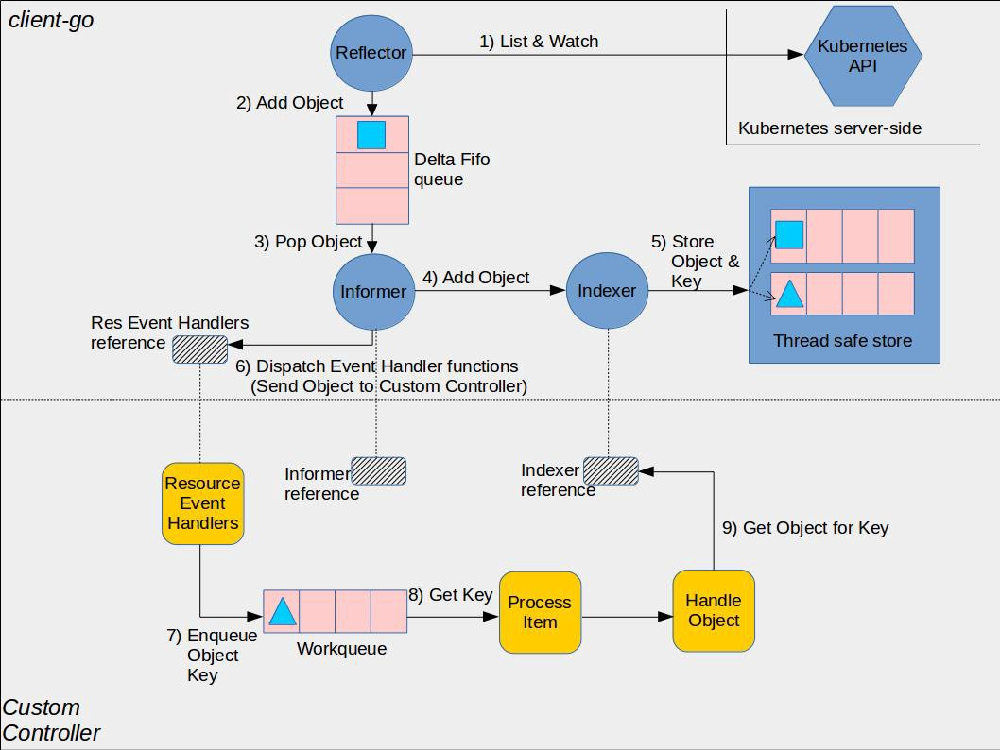

- `Reflector`  
`Reflector` 对 `API server` 进行 `List-Watch` 操作，当监听资源对象变化的时候，将对象加入 `DeltaFIFO`
- `DeltaFIFO`  
生产者-消费者队列，生产者为 `Reflector`，消费者为 `Pop()` 函数
- `Indexer`  
`Pop()` 弹出对象放入 `Indexer` ，`Indexer` 为对象提供一定条件的检索功能

### Controller-manage

Controller-manage 是 k8s 当中一些列控制器的集合，它们被编译成一个二进制文件。常用的控制器有：

- `Replicaset` 管理 `Pod` 副本数
- `Deployment` 管理 `Replicaset` 部署无状态服务
- `Statefulset` 管理 `Pod` 部署有状态服务
- `Job` 管理 `Pod` 创建一次性任务
- `Crontab` 定时运行 `Job`

下面看看创建一个 deployment 会发生什么：

```shell
kubectl create -f deployment.yaml
```

1. kubectl 会验证提交的资源是否合法，例如错误的文件格式或者不支持的资源
2. kubectl 通过 HTTP 与 API server 协商合适的 API Group
3. API server 验证客户端身份（默认为证书）是否有效
4. API server 通过权限模型（默认为`RABC`）验证该身份是否有权限操作该资源
5. API server 将对象持久化到 etcd
6. deployment 控制器监听 API server，根据 deployment 的期望状态创建 replicaset
7. replicaset 控制器监听 API server，根据 replicaset 的期望状态创建 Pod
8. Scheduler  监听 API server，根据算法确认 Pod 将在 那个节点运行
9. kubelet 监听 API server，发现有属于自己节点的 Pod，于是调用容器运行时创建 Pod 所需的容器

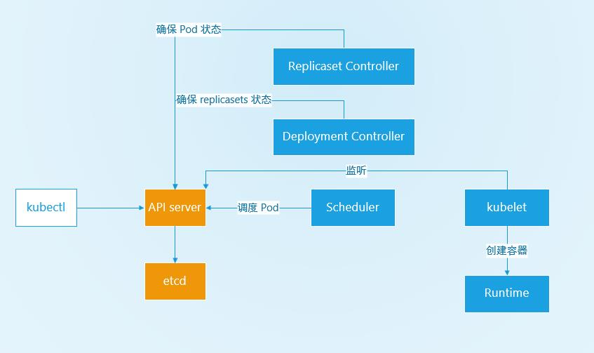

### Scheduler

#### 预选算法  

首选排查掉不符合条件的节点，下面列举几个重要的检查器

- MatchNodeSelector  
检查节点是否满足 Pod 的 NodeSelector 要求
- PodFitsResources  
检查节点的资源剩余是否满足 Pod 的请求
- MatchInterPodAffinity  
检查节点是否满足 Pod 的亲和性(`requiredDuringSchedulingIgnoredDuringExecution`)要求
  
#### 优选算法  

在符合条件的节点列表中打分，得分最高的节点会被选中，下面是主要的打分器：  

- LeastRequestedPriority  
Pod 资源 `request` 占节点可以资源的百分比，百分比越低打分越高
- SelectorSpreadPriority  
节点上属于同一个 Replicaset 的 Pod 数量，数量越少打分越高
- NodeAffinityPriority  
尽量(`preferresDuringSchedulingIgnoredDuringExecution`)满足节点亲和性选择  
- InterPodAffinityPriority  
尽量(`preferresDuringSchedulingIgnoredDuringExecution`)满足 Pod 间亲和性选择  

### Kubelet

kubelet 主要分成三层，`API` 层、`syncLoop` 层、`CRI` 及以下

#### syncLoop

kubelet 的工作主要是围绕一个 `syncLoop` 来展开，各组件监听 `loop` 消费事件，或者往里面生产 `pod` 相关的事件，整个控制循环由事件驱动运行

- `PLEG`  
调用`容器运行时`接口获取容器的状态，与本地维护的 `pod cache` 进行对比，生成对应的 `podLifecycleEvent`，然后通过 `eventChannel` 发送到 `syncLoop`，然后由定时任务来同步 `pod`，最终达到用户的期望状态
- `CAdvisor`  
集成在 kubelet 中的容器监控工具，用于收集本节点和容器的监控信息
- `podWorkers`  
注册了多个 `handler`，分别处理 `pod` 的不同事件，包括创建、更新、删除
- `oomWatcher`  
系统 `OOM` 的监听器，通过 `Watch` 方式从 `CAdvisor` 那里收到的 `OOM` 信号，并产生相关事件
- `containerGC`  
负责清理无用的容器
- `imageGC`  
负责清理无用的容器镜像
- `Managers`  
负责管理与 `pod` 相关的各类资源，主要有 `imageManager volumeManager evictionManager statusManager probeManager runtimeManager podManager`，各 `manager` 各司其职，在 `syncLoop` 中协同工作

#### 插件

kubelet 不直接实现容器相关的功能，而是通过插件的形式对接各种功能

- `CRI` 容器运行时接口，对接容器运行时管理容器和镜像
- `CNI` 容器网络接口，对接网络插件为容器提供集群网络
- `CSI` 容器存储接口，对接存储插件为容器提供存储

### Kube-proxy

kube-proxy 负责在集群所有节点创建网络规则以实现 `service`，它通过 API server 监听 `endpoint` (包含了 Pod IP 地址)的变化及时的更新这些网络规则

#### Iptables 模式

iptables 为防火墙设计，iptables 规则基于顺序匹配，iptables 规则数量和 service、Pod数量呈线性，规则越多性能越差

iptables 支持少量的负责均衡算法：随机、轮询

service 配置

```yaml
kind: Service
apiVersion: v1
metadata:
  name: www-nginx
  namespace: default
  labels:
    app: www-nginx
  annotations:
    kubesphere.io/creator: admin
spec:
  ports:
    - name: http
      protocol: TCP
      port: 8080
      targetPort: 80
  selector:
    app: www-nginx
  clusterIP: 172.31.10.110
  type: ClusterIP
```

规则分析：

```shell
# 拦截入站流量
iptables -t nat  -nL PREROUTING
KUBE-SERVICES  all  --  0.0.0.0/0            0.0.0.0/0            /* kubernetes service portals */

# 标记非容器网段访问 clusterIP:PORT 的流量，以便 SNAT
# 拦截截 clusterIP:PORT 流量，进入 SVC 子链
iptables -t nat -nL KUBE-SERVICES
KUBE-MARK-MASQ  tcp  -- !172.30.0.0/16        172.31.10.110        /* default/www-nginx:http cluster IP */ tcp dpt:8080
KUBE-SVC-ER4LEIYRRL5J5V2O  tcp  --  0.0.0.0/0            172.31.10.110        /* default/www-nginx:http cluster IP */ tcp dpt:8080

# 根据 Pod 副本数随机进入 SEP 子链
iptables -t nat -nL KUBE-SVC-ER4LEIYRRL5J5V2O         
KUBE-SEP-Y2MQTTWPYOD4GHTI  all  --  0.0.0.0/0            0.0.0.0/0            /* default/www-nginx:http */ statistic mode random probability 0.50000000000
KUBE-SEP-2LUZGPXRT4T2UN3O  all  --  0.0.0.0/0            0.0.0.0/0            /* default/www-nginx:http */

# 如果 Pod 访问 clusterIP 流量路由到了自身，需要标记流量，以便 SNAT （自身访问自身，需要开启hairpinMode）
# 将流量 DNAT 到 Pod 的 IP:PORT
iptables -t nat -nL KUBE-SEP-Y2MQTTWPYOD4GHTI
KUBE-MARK-MASQ  all  --  172.30.30.228        0.0.0.0/0            /* default/www-nginx:http */
DNAT       tcp  --  0.0.0.0/0            0.0.0.0/0            /* default/www-nginx:http */ tcp to:172.30.30.228:80

```

延伸知识：当一个网络包进入网桥的端口后，会广播到其它端口，本端口不会再发出这个包。如要要让包从相同端口收发，那么需要开启 `hairpinMode` （发夹模式）

#### IPVS 模式

ipvs 专为负载均衡设计，规则基于Hash表，规则数量对性能影响较小，为大型集群提供了更好的可扩展性和性能  

ipvs 支持更多的负载均衡算法，随机、轮询、最小负载、最少连接、加权负载

ipvs 模式下依然依赖 iptables 防火墙规则，但是 clusterIP 被设置进 `ipset` 合集，所以 iptables 规则数量也是恒定的

service 配置

```yaml
kind: Service
apiVersion: v1
metadata:
  name: www-nginx
  namespace: default
  labels:
    app: www-nginx
  annotations:
    kubesphere.io/creator: admin
spec:
  ports:
    - name: http
      protocol: TCP
      port: 8080
      targetPort: 80
  selector:
    app: www-nginx
  clusterIP: 10.129.31.111
  type: ClusterIP
```

规则分析：

```shell
# 拦截入站流量
iptables -t nat  -nL PREROUTING
KUBE-SERVICES  all  --  0.0.0.0/0            0.0.0.0/0            /* kubernetes service portals */

# 标记非容器网段访问 clusterIP:PORT 的流量，以便 SNAT
# 直接放行访问 clusterIP:PORT 的流量
iptables -t nat -nL KUBE-SERVICES
KUBE-MARK-MASQ  all  -- !10.128.0.0/16        0.0.0.0/0            /* Kubernetes service cluster ip + port for masquerade purpose */ match-set KUBE-CLUSTER-IP dst,dst
ACCEPT     all  --  0.0.0.0/0            0.0.0.0/0            match-set KUBE-CLUSTER-IP dst,dst

# ipvs 拦截 clusterIP:PORT 的流量，将流量负载均衡到 Pod 的 IP:PORT
ipvsadm -ln |grep -A2 10.129.31.111
TCP  10.129.31.111:8080 rr
  -> 10.128.0.128:80              Masq    1      0          0         
  -> 10.128.3.183:80              Masq    1      0          0 
```

原理分析：

1. 流量进入 PREROUTING 链
2. kube-proxy 将 clusterIP 绑定到 kube-ipvs0 虚拟网卡
3. 内核判断目的地址为本机，流量进入 INPUT 链
4. IPVS 工作在 INPUT 链，如果目的地址:端口等于clusterIP:PORT
5. LVS调度器根据算法决定流量路由到某个后端
6. 修改clusterIP 为 后端 PodIP

## 云原生网络

### Flannel 插件

flannel 项目是在三层物理网络之上构建一个可跨节点通信 `overlay network` （平面网络）

在 k8s 中 flannel 作为标准 CNI 插件，每个节点都会运行一个 `flanneld` 的二进制代理程序。

#### VxLan 模式

vxlan 模式兼容性较强只要两个主机能够进行 `udp` 通信那么就可以建立vxlan隧道  
vxlan 模式下原始报文需要封装成 vxlan 格式并通过 udp 隧道传输，所以性能有一定的损耗

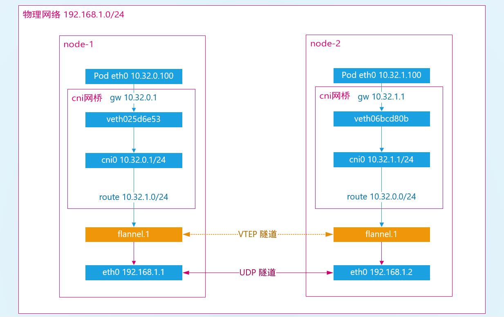

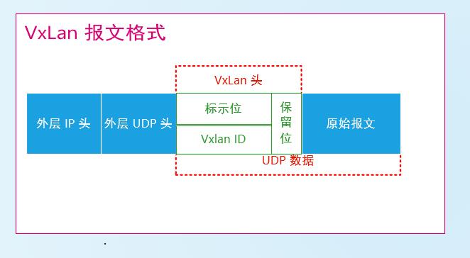

**pod(10.32.0.100) 访问 pod(10.32.1.100) 流程解析：**

1. `pod` 创建时会创建一个 `veth` 设备，`veth` 一头连接容器的 `eth0` 另一头连接 `cni 网桥`端口
2. `10.32.1.100` 不是本地网络，流量进入容器的默认网关 `cni0`
3. `cni0` 查找路由表发现 `10.32.1.0/24` 指向了vxlan网卡 `flannel.1(10.32.0.0)`，流量进入 `flannel.1`
4. `flannel.1` 将原始数据帧封装成 `vxlan 格式报文` （linux 内核支持vxlan，此步骤由内核完）
5. `vxlan 报文` 无法在物理网络传输，需要封装在 `vtep 隧道`中传输
6. `vtep 隧道`基于 `udp 协议`，`node-1` 将 `udp 报文`发送到 `node-2`
7. `node-2` 收到 `udp 报文`，`udp 报文`解封后，根据 `vxlan 头信息`把数据转交给 `flannel.1(10.32.1.0)` 处理
8. `flannel.1` 解封 `vxlan 报文`，得出`原始报文`

在整个vxlan网络通信过程中，原本需要协议解析的信息是已知的，flanneld 需要手动维护这些信息：  

- 路由表：静态路由表

```shell
route
10.32.1.0       10.32.1.0       255.255.255.0   UG    0      0        0 flannel.1
```

- ARP 表：常规 Lan 中可以通过 ARP 协议解析出 MAC 地址，VxLan 需要提前确定好 ARP 表

```shell
ip neigh show dev flannel.1
10.32.1.0 lladdr 3e:f6:4e:67:21:7c PERMANENT
```

- FDB 表：Linux 网桥 MAC 学习表，它记录了 MAC 地址可以从哪到达

```shell
bridge fdb show dev flannel.1
3e:f6:4e:67:21:7c dst 192.168.1.2 self permanent
```

#### host-gw 模式

host-gw 相对 vxlan 相对比较简单，host-gw 直接把每个节点作为一个`网关`，每个网关知道整个集群 Pod 子网的路由信息。
host-gw 模式下没有`封装开销`，完全基于三层路由转发，但是 host-gw 的网关必须在`同一个二层网络`

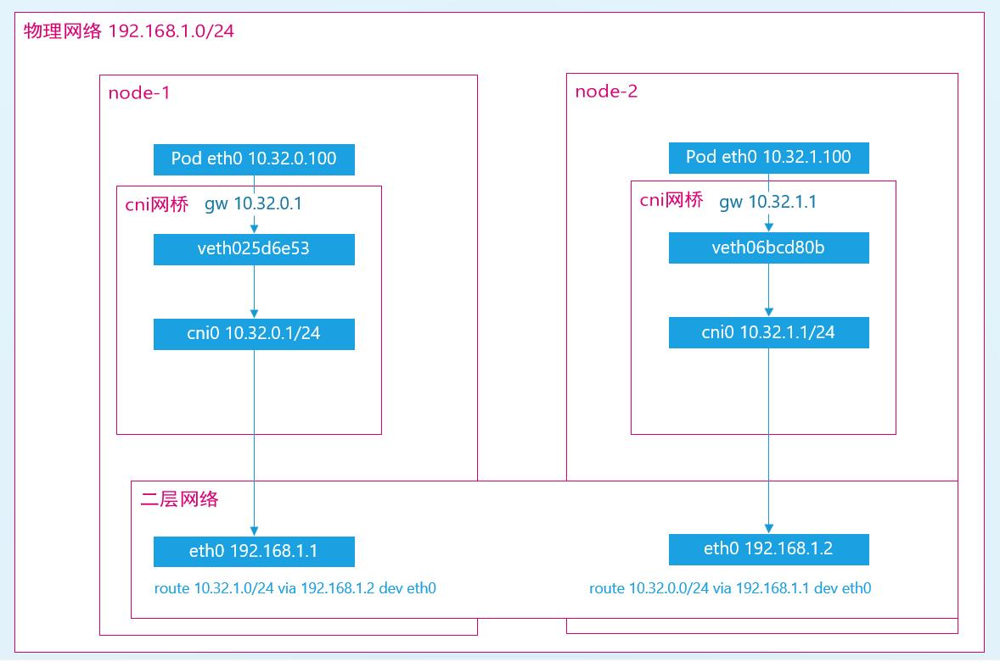

### Calico 插件

Calico 是针对容器、虚拟机场景下提供跨宿主机互通的开源网络和安全解决方案，支持复杂的网络策略

Calico 的特点就是把每个宿主机当中一个虚拟路由器建立与物理网络对等的虚拟网络，BGP 协议在网络中通告 Pod 子网路由信息，该模式与 host-gw 相似完全基于三层路由转发，避免报文被二次封装

Calico 的主要组件:

- `Felix`：每个节点都要运行的calico agent，负责配置节点上的路由信息和 ACL
- `ETCD`：配置中心，主要负责网络元数据一致性，确保 Calico 网络状态的准确性
- `BGP Client(BIRD)`：主要负责把 Felix 配置的路由信息分发到当前 Calico 网络，确保节点间能够进行三层通信

#### BGP 模式

BGP 模式 Pod 跨节点通信不会进行任何封装，全部基于三层网络进行路由转发，值得注意的是同节点 Pod 通信不在通过 cni 网桥，而是直接使用静态路由直接指向 `veth pair` 设备一端 `calixxx`(另一端是 Pod-eth0)

BGP 模式依赖二层广播域，所以 vRouter 必须在同一个二层网络

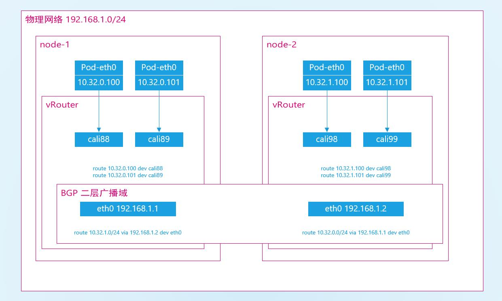

#### IPIP 模式

如果网络节点跨二层网络那么 BGP 模式就不在适用，因为中间路由器不知道容器子网的路由，IPIP 模式可以节点间建立 `IP tunnel`，通过 `IP tunnel` 可以跨节点进行路由转发

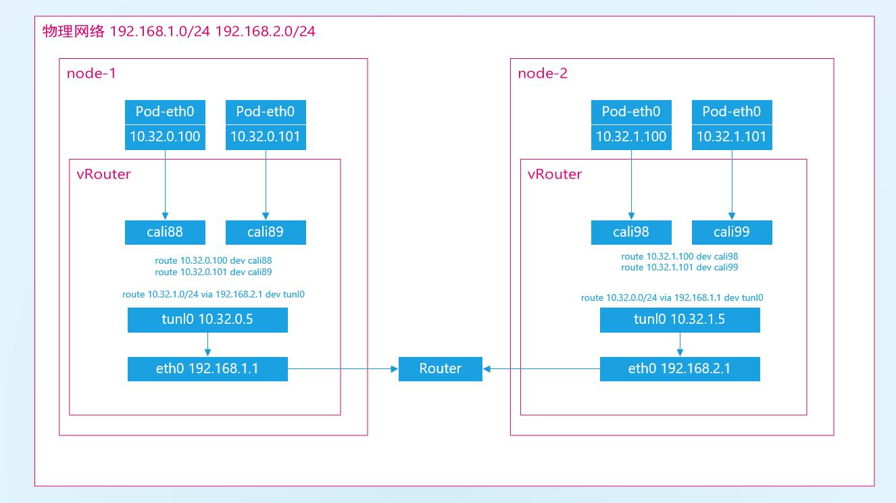

**跨节点通信分析：**  
BGP 模式 Pod 子网路由下一跳直接指向了该子网所在的节点 node-2

如果要数据包经过中间路由器，源 IP 为 10.32.0.100 目的 IP 为 10.32.1.100 ，中间路由器不知道 10.32.1.100 的路由，数据包被丢弃

IPIP 模式下 Pod 子网路由下一跳指向了 tunl0 ，tunl0 进行一次IP 头封装，源 IP 替换为 192.168.1.1 目的 IP 替换为 192.168.2.1
