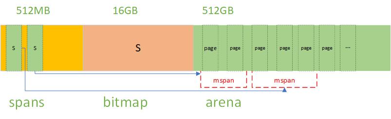
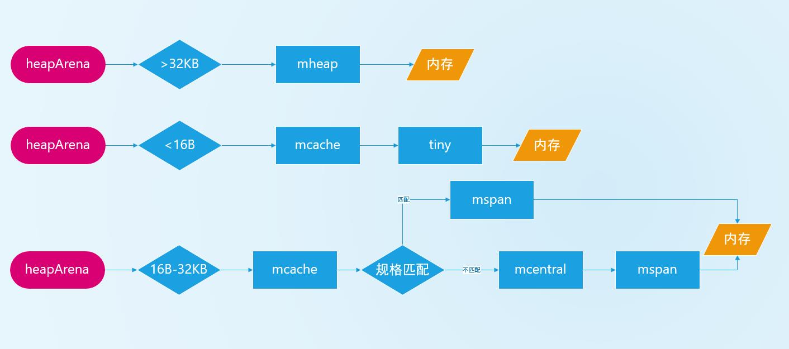
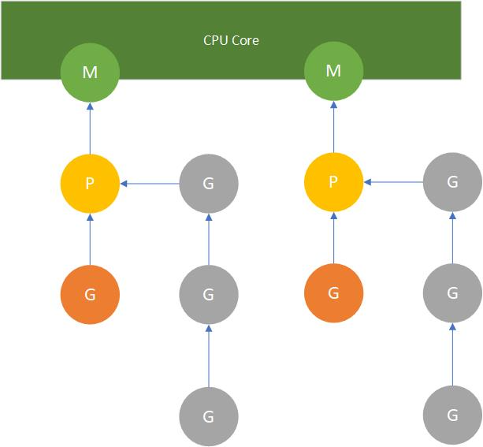

# Golang

## 数据类型

### 布尔类型

- `true`
- `false`

### 数字类型

- 有符号整型：`int8 int16 int32 int64`
- 浮点型：`float32 float64`
- 无符号整形：`uint8 uint16 uint32 uint64`

### 字符串类型

- 不可变字节定长数组，字符串可以包含任意数据

### 派生类型

- 指针类型  
指针地址指向一个变量的内存地址，指针地址可以取值和修改值
- 数组类型  
数组由零个或多个相同类型的元素组成，元素可以修改，数组的长度不可改变
- 切片类型  
是对数组的一个连续片段的引用，切片的的长度是可变的
- map类型  
map 是一种特殊的数据结构， 由 key 和一个 value 组成的
- 结构体(struct)类型  
结构体是由一系列具有相同类型或不同类型的数据构成的数据集合
- 接口类型  
具有共性的方法定义在一起，任何其他类型只要实现了这些方法就是实现了这个接口
- 管道(channel)类型  
channel是一个先进先出的消息队列
- 函数类型

### 其他数据类型

- `int`  
有符号整形对应特定CPU平台的字长
- `uint`  
无符号整形对应特定CPU平台的字长
- `byte`  
与uint8等价，代表ASCII码的一个字符
- `rune`  
与int32等价，代表一个UTF-8字符
- `uintptr`  
无符号整型，用于存放一个指针

## 基础语法

### 声明变量

`var` 声明变量， 没有赋值时置为类型零值
`make` `slice` `map` `chan`  类型初始化并分配内存，返回类型本身
`new` 类型初始化并分配内存，返回类型指针

```go
package main

func main() {
    // 长声明
    var age int
    age = 10

    // 短声明
    age := 10

    // 声明多个变量
    var (
        a = 10
        b = 10
    )
}
```

### 声明常量

```go
package main

func main() {
    const age = 10
    const (
        a = 10
        b = 20
    )
}
```

### 变量的作用域

- 函数内定义的变量称为局部变量
- 函数外定义的变量称为全局变量
- 函数定义中的变量称为形式参数

### 使用切片

```go
package main

func main() {
    // 使用:=赋值不会预分配空间赋几个值就是多大空间，make 可以根据长度预分配空间
    // 创建切片
    l := []int{5, 4, 3, 2, 1}

    // 使用make创建
    l2 := make([]int, 5)
    l2 = []int{1, 2, 3, 4, 5}

    // 修改元素
    l[0] = 1

    // 扩容切片
    l = append(l, 3)

    //删除元素
    l = l[1:]  // 删除开头元素
    l = l[:len(l)-1]  // 删除尾部元素

    // 切片拷贝
    l3 := make([]int, 5)
    copy(l3, l2)

    // 获取切片长度
    _ = len(l)

    // 获取切片最大容量
    _ = cap(l)

    // 截取片段
    l = l[0:2]

}
```

### 使用map

```go
package main

func main() {
    // 创建map
    m := make(map[string]string)

    // 增加键值
    m["姓名"] = "三木"
    m["岗位"] = "销售"

    // 删除键
    delete(m,"岗位")
}
```

### 流程控制

```go
package main

import "fmt"

func main() {
    var a int = 10
    if a > 20 {
        fmt.Println("a的值大于20")
    }else{
        fmt.Println("a的值小于20")
    }

    // ||左右两边有一个为真，则为真
    if a > 5 || a < 20 {}

    // ||左右两边都为真，则为真
    if a > 20 || a > 5 {}

    // 选择语句
    grade := "A"
    switch {
    case grade == "A":
        fmt.Println("优秀!")
    case grade == "B":
        fmt.Println("良好")
    default:
        fmt.Println("差")
    }
}    
```

### 循环语句

```go
package main

func main() {
    for i := 0; i < 10; i++ {
        continue // 跳出当前循环
        break // 跳出循环
    }

    // range范围遍历，可以遍历数组、切片、channel、map
    n := []int{1, 2, 3, 4}
    for _, i := range n {
        fmt.Println(i)
    }

    // 嵌套循环使用标记跳出
    l := []int{15, 5}
Loop: // 标记
    for _, item := range l {
        for i := 0; i < 2; i++ {
            if item > 10 {
                fmt.Println("item大于10", item)
            } else {
                fmt.Println("item小于10，结束父循环", item)
                continue Loop
            }
        }
    }    
}
```

### 定义结构体

```go
package main

type Student struct {
    Name string
    Age int
}
```

### 实例化结构体

```go
package main

import "fmt"

func main() {
    s := &Student{}
    s.Age = 10
    fmt.Println(s)
}    
```

### 函数定义

```go
package main

func funcName(name sring, age int )(string, int){
    return name, age
}
```

### 匿名函数

匿名函数是指没有函数名的函数，需要在定义处直接使用，匿名函数可用于闭包

```go
package main

func (a int, b int) int {
    return a + b
}
```

### 可变参数

```go
package main

func myFunc(args ...int) {
    for _, arg := range args {
        fmt.Println(arg)
    }
}
```

### 构造函数

```go
package main

func NewStudent(name sring, age int) *Student {
    return &Student {
        Name: name,
        Age: age
    }
}

func main() {
    s := NewStudent("三木"， 20)
}
```

### 使用指针

`&` 符号是取出值的指针地址  
`*` 符号是取值指针地址对应的值

```go
package main

import "fmt"

func main() {
    var a int = 5
    var b *int
    b = &a
    fmt.Printf("b是指针类型: %v, 取值%v: ", b, *b)
}
```

### defer关键字

```go
package main

func main() {
    // defer定义的逻辑会在代码结尾执行，defer的执行顺序是后进先出
    defer fmt.Println("defer1")
    defer fmt.Println("defer2")
}
```

控制台输出：

```bash
defer2
defer1
```

## 面向对象

### 定义接口

```go
type Person {
    // 接口方法
    GetAge() int
}
```

### 实现接口

函数名和接口的方法名相同，那么这个函数就实现了接口的方法

```go
func (g *Student) GetAge() int  {
    return g.Age
}
```

### 使用接口

```go
package main

import "fmt"

type Person interface {
    GetAge() int
}

type Student struct {
    Age int
}

func (g *Student) GetAge() int  {
    return g.Age
}

func main() {
    s := &Student{}
    s.Age = 10
    var p Person = s
    res := p.GetAge()
    fmt.Printf("学生的年龄是 %v", res)
}
```

## 对象反射

### 反射变量

```go
package main

import (
    "fmt"
    "reflect"
)

func reflectInt(x *int) {
    v := reflect.ValueOf(x) //取值
    t := reflect.TypeOf(*x) //取类型
    if t.Kind() == reflect.Int {
        v.Elem().SetInt(100) //设置值，v应该为指针
    }
}

func main() {
    i := 10
    reflectInt(&i)
    fmt.Println("i的值应为100") 
}
```

### 反射结构体

```go
package main

import (
    "fmt"
    "reflect"
)

type Student struct {
    Name string `json:"name"`
    Age  int `json:"age"`
}

func reflectStruct(x *Student) {
    v := reflect.ValueOf(x)
    if v.Kind() == reflect.Ptr {
        v.Elem().FieldByName("Name").SetString("李四")
        v.Elem().Field(0).SetString("王二")
    }

    t := reflect.TypeOf(*x)
    vv := reflect.ValueOf(*x)
    if t.Kind() == reflect.Struct {
        n := vv.NumField() //取结构体的长度
        for i := 0; i < n; i++ {
            f := vv.Field(i)
            name := t.Field(i).Name
            fmt.Printf("字段名=%v,字段类型=%v,字段值=%v,tag=%v\n", name, f.Type(), f.Interface(),t.Field(i).Tag)
        }
    }
}

func main() {
    s := &Student{}
    s.Name = "张三"
    reflectStruct(s)
}
```

### 反射方法

```go
package main

import (
    "fmt"
    "reflect"
)

type Student struct {
    Name string `json:"name"`
    Age  int `json:"age"`
}

func reflectMethod(x *Student) {
    v := reflect.ValueOf(x)
    m := v.NumMethod()
    for i := 0; i < m; i++ {
        m := v.Type().Method(i)
        fmt.Printf("方法名=%v, 方法类型=%v\n", m.Name, m.Type)
        f1 := v.MethodByName("Print")
        var args []reflect.Value
        f1.Call(args) //没有参数调用方法

        f2 := v.MethodByName("Print2")
        age := 10
        argsR := reflect.ValueOf(age)
        args2 := append(args, argsR)
        f2.Call(args2) //有参数调用方法
    }
}

func (s *Student) Print() {
    fmt.Println("我是方法", s)
}

func (s *Student) Print2(age int) {
    s.Age = age
    fmt.Println("我是方法", s)
}

func main() {
    s := &Student{}
    s.Name = "张三"
    reflectMethod(s)
}
```

## Go内存管理

### 虚拟内存池

程序启动时Go的运行时会向操作系统申请一块虚拟空间内存池，并使用 `tcmalloc` 算法管理内存  
申请到的内存块被分配了三个区域，在64位系统上分别是512MB，16GB，512GB大小

- `arena` 区域 (512GB)  
Go动态分配的内存都是在这个区域，它把内存分割成8KB大小的页，一些页组合起来称为 `mspan`
- `bitmap` 区域 (16GB)  
标识arena区域哪些地址保存了对象，并且用4bit标志位表示对象是否包含指针、GC标记信息
- `spans` 区域 (512MB)  
用于存放 `mspan` 的指针，每个指针对应一页  
创建 `mspan` 的时候，按页填充对应的 `spans` 区域，在回收对象时，根据地址很容易就能找到它所属的 `mspan`


### 内存分配组件

- `heapArena`  
保留整个内存池的虚拟地址空间
- `mheap`  
分配的 `arena` 堆区域，在页大小为 8KB 的粒度上进行管理
- `mspan`  
内存管理的基本单元，它由若干个页组成，每种 `mspan` 可以分配特定大小的对象
- `mcentral`  
`mcentral` 管理全局的 `mspan` 供所有线程使用
- `mcache`  
`mcache` 管理线程在本地缓存的 `mspan`

### 内存分配原则

- 大于 `32KB` 的对象从 `mheap` 中分配
- 小于 `16B` 的对象使用 `mcache` 的 `tiny` 分配器分配
- `16B-32KB` 之间的对象，首先计算对象的规格大小，然后使用 `mcache` 中相应规格大小的 `mspan` 分配  
如果 `mcache` 没有相应规格大小的 `mspan` ，则向 `mcentral` 申请  


### Go内存回收

Go的运行时使用三色标记清除法进行GC  

- 白色标记  
- 灰色标记  
- 黑色标记  

1. GC启动前所有对象都是白色标记
2. 遍历白色标记集合，把有根对象（栈上对象或堆全局变量）引用的对象放入灰色标记集合
3. 遍历灰色集合，把白色标记集合当中的有灰色标记对象引用的对象，放入灰色集合
4. 把灰色集合放入黑色集合
5. 重复第3、4步，直到灰色集合中无任何对象
6. 回收白色集合里的所有对象，本次垃圾回收结束

### 栈空间  

栈空间由 Go 编译器进行管理，自动申请、分配、释放，函数的参数和局部变量一般在函数运行时放入栈空间，函数运行之后栈空间会被自动释放  
申请和释放栈空间只需要 CPU 的两个指令：`PUSH POP`  
结论：栈空间的申请和释放开销非常小，所以性能比堆要好，栈空间释放是自动的不需要GC。

### 逃逸分析

Go 编译器需要知道变量需要分配在栈上，还是堆上，称之为逃逸分析  
**逃逸分析的作用：**

- 优先把对象分配到栈空间，减少GC，优化性能
- 模糊堆和栈的边界  

**逃逸分析的原则：**

- 如果变量在函数外部没有引用，则优先放到栈中
- 如果变量在函数外部存在引用，则必定放在堆中
- 如果不确定变量在函数外部是否存在引用，则必定放在堆中

## Go并发

### goroutine

goroutine是Go语言提供的一种用户态[协程]，goroutine由Go的运行时调度

多个goroutine共享堆不共享栈，栈空间可以动态伸缩 ,协程有Go语言代码显式管理

### goroutine 栈空间

Golnag v1.3 版本引入连续栈空间替换了之前版本的分段不连续栈空间

- 栈空间扩容  
goroutine 创建时分配初始栈空间 2KB ，当栈空间不够时，直接new一个2倍大的栈空间  
然后把旧栈数据拷贝到新栈空间，接着销毁旧栈空间
- 栈空间缩小  
实际使用内存只有四分之一时，GC时缩小二分之一空间

### goroutine调度

多个goroutine属于一个操作系统线程，操作系统最小调度单位是线程，所以操作系统无法调度goroutine，这时候就需要一个调度器来维护这些goroutine，确保goroutine尽可能公平的使用CPU

运行时是如何调度goroutine ？

- G (goroutine)  
goroutine的实体，每次go调用的时候就会创建一个G对象，有独立的栈空间
- M (work thread)
操作系统线程，具体干活的人
- P (processor)
M和G的调度上下文，每一个运行的M都必须绑定一个P  
P的数量由`GOMAXPROCS()`设置，也就是说P的数量就是M的数量，也就是要使用多少个线程完成goroutine。`GOMAXPROCS()`默认等于CPU的核数



### goroutine与线程比较

- 协程创建内存消耗更少
- 协程无需CPU上下文切换开销
- 协程调度更快
- 在操作系统维度可以对线程实现公平调度，goroutine是非侵入的，操作系统无法给它分配资源

### channel

channel是一个先进先出的消息队列，用于在不同的goroutine之间传递数据，一个channel同时只能被一个goroutine占用

### channel的三种操作

- `send`  
向channel发送数据
- `receive`  
从channel中读取数据  
- close  
关闭channel，关闭后  
send 操作会 painc
receive 操作会返回channel类型的空值，以及状态码false  

### channel的两种模式

- 阻塞模式  
发送端向channel发送一个数据，在接收端接收之前被阻塞  
接收端一直被阻塞，直到发送端向channel发送了一个数据

```go
package main

import (
    "fmt"
    "time"
)

func send(c chan string) {
    fmt.Println("发送消息：开始")
    time.Sleep(time.Second * 1)
    c <- "开始" // 发送channel的数据没被读取前会阻塞

    time.Sleep(time.Second * 1)
    fmt.Println("发送消息：结束")
    time.Sleep(time.Second * 1)
    c <- "结束"
}

func receive(c chan string) {
    var x string
    for  {
        x = <-c // 当channel没有数据时会阻塞执行
        fmt.Println("接收消息", x)
    }
}

func main() {
    c := make(chan string)
    go send(c)  // 向channel发送数据
    go receive(c)  // 读取channel数据

    time.Sleep(time.Second * 5)
}
```

- 非阻塞模式  
发送端向channel发送多个数据，在channel容量满之前不会被阻塞  
接收端按照队列（ `FIFO` 先进先出）的方式从channel队列中读取数据

```go
package main

import (
    "fmt"
    "time"
)

func send(c chan string) {
    fmt.Println("发送消息：开始")
    time.Sleep(time.Second * 1)
    c <- "开始" // 发送channel的数据在缓存区满之前不会阻塞

    time.Sleep(time.Second * 1)
    fmt.Println("发送消息：结束")
    time.Sleep(time.Second * 1)
    c <- "结束"
}

func receive(c chan string) {
    var x string
    for  {
        x = <-c // 当channel没有数据时会阻塞执行
        fmt.Println("接收消息", x)
    }
}

func main() {
    c := make(chan string, 5) // 设置channel缓存区容量
    go send(c)  // 向channel发送数据
    // go receive(c)

    time.Sleep(time.Second * 5)
}
```

## 并发控制

### 等待并发结束

```go
package main

import (
    "fmt"
    "sync"
    "time"
)

func worker(wg *sync.WaitGroup) {
    defer wg.Done()
    time.Sleep(time.Second * 3)
}
func main() {
    wg := new(sync.WaitGroup)
    for i := 0; i < 10; i++ {
        wg.Add(1)
        go worker(wg)
    }
    wg.Wait()
    fmt.Println("工作全部完成")
}
```

### select多路监听

`case`必须是一个通信操作，要么是发送要么是接收  
`select`会随机执行`case`直到有一个满足条件

```go
package main

import (
    "fmt"
    "time"
)

func send(c chan int) {
    c <- 1
    c <- 2
    c <- 3
    c <- 4
    c <- 5
}

func main() {
    c := make(chan int)
    c2 := make(chan int)
    go send(c)
    go send(c2)
    for {
        select {
        case x := <-c:
            fmt.Println("c接收到消息", x)
        case x := <-c2:
            fmt.Println("c2接收到消息", x)
        default:
            fmt.Println("等待中")
            time.Sleep(time.Second * 1)
        }
    }
}
```

#### select 超时实例

```go
package main

import (
    "fmt"
    "time"
)

func worker(c chan bool) {
    time.Sleep(time.Second * 2) // 小于3秒不会报超时
    c <- true
}

func main() {
    c := make(chan bool)
    go worker(c)
    select {
    case x := <-c:
        fmt.Println("worker执行完毕", x)
    case <-time.After(time.Second * 3):
        fmt.Println("worker超时了")
    }
}

```

#### select 计时器实例

```go
package main

import (
    "fmt"
    "sync"
    "time"
)

func TimeTicker(wg *sync.WaitGroup, c chan bool) {
    defer wg.Done()
    t := time.NewTicker(time.Second * 3)
    defer t.Stop()
    for {
        select {
        case <-c:
            // 执行close(c)后退出函数
            fmt.Println("退出")
            return
        case <-t.C:
            fmt.Println("执行计时器")
        }
    }
}
func main() {
    c := make(chan bool)
    var wg sync.WaitGroup
    wg.Add(1)
    go TimeTicker(&wg, c)
    time.Sleep(time.Second * 10)
    close(c)
    wg.Wait()
}
```

### context

context.Context 是 Go 语言中用来设置截止日期、同步信号，传递请求相关值的结构体

context 包主要提供了两种方式创建根 context:

- `context.Backgroud()` 是上下文的默认值，所有其他的上下文都应该从它衍生（Derived）出来
- `context.TODO()`  应该只在不确定应该使用哪种上下文时使用

创建的根不具备任何功能，需要派生出`With`函数使用：

- `context.WithCancel`

```go
package main

import (
    "context"
    "fmt"
    "time"
)

func worker(ctx context.Context, duration time.Duration) {
    select {
    case <-ctx.Done():
        fmt.Println("工作超时", ctx.Err())
    case <-time.After(duration):
        fmt.Println("工作执行完毕")
    }

}

func main() {
    ctx, cancel := context.WithCancel(context.Background())
    go worker(ctx, time.Second*3)
    time.Sleep(time.Second * 1)
    cancel()
    time.Sleep(time.Second * 10)
}

```

- `context.WithTimeout()`

```go
package main

import (
    "context"
    "fmt"
    "time"
)

func worker(ctx context.Context, duration time.Duration) {
    select {
    case <-ctx.Done():
        fmt.Println("工作超时", ctx.Err())
    case <-time.After(duration):
        fmt.Println("工作执行完毕")
    }

}

func main() {
    ctx, cancel := context.WithTimeout(context.Background(), time.Second*2)
    defer cancel()
    go worker(ctx, time.Second*3)
    select {
    case <-ctx.Done():
        time.Sleep(time.Second * 1)
        fmt.Println("已超时")
    }
}
```

- `context.WhithDeadline`

```go
package main

import (
    "context"
    "fmt"
    "time"
)

func worker(ctx context.Context, duration time.Duration) {
    select {
    case <-ctx.Done():
        fmt.Println("工作超时", ctx.Err())
    case <-time.After(duration):
        fmt.Println("工作执行完毕")
    }

}

func main() {
    d := time.Now().Add(time.Second * 2)
    ctx, cancel := context.WithDeadline(context.Background(), d)
    defer cancel()
    go worker(ctx, time.Second*1)
    select {
    case <-ctx.Done():
        fmt.Println("已到规定时间", d)
        time.Sleep(time.Second * 1)
    }
}
```

- `context.WithVaule()`

```go
package main

import (
    "context"
    "fmt"
    "time"
)

func worker2(ctx context.Context) {
    fmt.Printf("worker2 ID=%s", ctx.Value("id"))
}

func worker(ctx context.Context) {
    fmt.Printf("worker ID=%s \n", ctx.Value("id"))
    go worker2(ctx)
}

func main() {
    ctx := context.WithValue(context.Background(), "id", "100")
    go worker(ctx)

    time.Sleep(time.Second * 1)
}
```

### sync

- `sync.Mutex`

```go
package main

import (
    "fmt"
    "sync"
)

var lock sync.Mutex
var count int

func add(wg *sync.WaitGroup) {
    defer wg.Done()
    defer lock.Unlock()
    lock.Lock()
    count += 1
}

func main() {
    wg := new(sync.WaitGroup)
    for i := 0; i < 100; i++ {
        wg.Add(1)
        go add(wg)
    }
    wg.Wait()
    fmt.Println(count)
}

```

- `sync.RWMutex`

```go
package main

import (
    "fmt"
    "sync"
)

var lock sync.RWMutex
var count int

func add(wg *sync.WaitGroup) {
    defer wg.Done()
    defer lock.RUnlock()
    lock.RLock()
    count += 1
}

func main() {
    wg := new(sync.WaitGroup)
    for i := 0; i < 100; i++ {
        wg.Add(1)
        go add(wg)
    }
    wg.Wait()
    fmt.Println(count)
}

```

- `sync.Once`

```go
package main

import (
    "encoding/json"
    "fmt"
    "io/ioutil"
    "sync"
)

type Config struct {
    Server string `json:"server"`
    Port   int    `json:"port"`
}

var once sync.Once
var Conf Config

func getConfig() {
    once.Do(func() {
        file, _ := ioutil.ReadFile("./config.json")
        _ = json.Unmarshal(file, &Conf)
        fmt.Println("只获取一次配置文件")
    })
}

func main() {
    getConfig()
    getConfig()
}
```

- `sync.Cond`

```go
package main

import (
    "fmt"
    "sync"
    "time"
)

var done = false

func read(name string, c *sync.Cond) {
    c.L.Lock()
    for !done {
        c.Wait()
    }
    fmt.Println(name, "开始读取")
    c.L.Unlock()
}

func write(name string, c *sync.Cond) {
    fmt.Println(name, "开始写入")
    time.Sleep(time.Second)
    c.L.Lock()
    done = true
    c.L.Unlock()
    fmt.Println(name, "唤醒所有")
    c.Broadcast()
}

func main() {
    cond := sync.NewCond(&sync.Mutex{})

    go read("r1", cond)
    go read("r2", cond)
    go read("r3", cond)
    write("w1", cond)

    time.Sleep(time.Second * 3)
}
```

- `sync.Pool`

```go
package main

import (
    "encoding/json"
    "sync"
)

type Log struct {
    Level   string `json:"level"`
    Message string `json:"message"`
}

var logPool = sync.Pool{
    New: func() any {
        return new(Log)
    },
}

var buf, _ = json.Marshal(Log{Level: "info", Message: "Tempor stet amet facilisi velit ad dolore."})

func LogPoolUnmarshal() {
    log := logPool.Get().(*Log)
    _ = json.Unmarshal(buf, &log)
    logPool.Put(log)
}

func LogUnmarshal() {
    var log Log
    _ = json.Unmarshal(buf, &log)
}

func main() {
    LogUnmarshal()
    LogPoolUnmarshal()
}
```

内存测试

```go
package main

import (
    "testing"
)

func BenchmarkLogPoolUnmarshal(b *testing.B) {
    for i := 0; i < b.N; i++ {
        LogPoolUnmarshal()
    }
}

func BenchmarkLogUnmarshal(b *testing.B) {
    for i := 0; i < b.N; i++ {
        LogUnmarshal()
    }
}
```

```bash
go test -v -bench . -benchmem -count=5
```
