# Mysql

## 主从复制

- 从库执行命令`start slave`，会开启两个线程I/O线程和SQL线程
- 主库会开启log dump 线程，用于发送binlog的变化，在读取binlog的过程中会加锁
- I/O线程用于接收log dump发送的变化，并存入relay-log中
- SQL线程负责读取relay-log中的数据，并解析成具体的操作执行

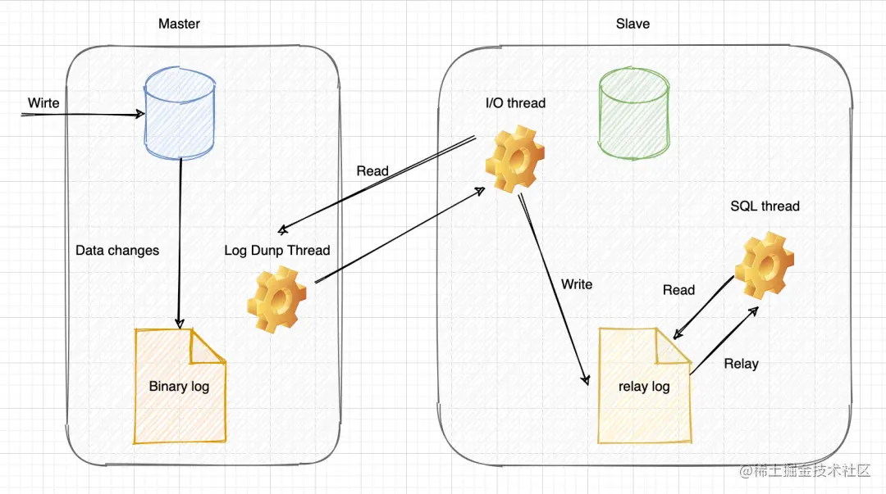

### 复制模式

- 同步复制，客户端事务完成后不会马上把结果返回，而是要等到从库复制该事务后返回
- 异步复制，客户端事务完成后立马返回结果，在把事务复制给从库
- 半同步复制，客户端事务完成后，有一个从库完成了事务复制后返回
- 延时复制，在异步的基础上加入延时

### 复制方式

- 语句复制，基于语句的复制相当于逻辑复制，即二进制日志中记录了操作的语句，通过这些语句在从数据库中重放来实现复制
- 行复制，基于行的复制相当于物理复制，即二进制日志中记录的实际更新数据的每一行

## 索引

### 优点

- 使用索引可以大大加快 数据的检索速度
- 通过创建唯一性索引，可以保证数据库表中每一行数据的唯一性

### 缺点

- 创建索引和维护索引需要耗费许多时间。当对表中的数据进行增删改的时候，如果数据有索引，那么索引也需要动态的修改，会降低 SQL 执行效率
- 索引需要使用物理文件存储，也会耗费一定空间

### 存储分类

- 聚簇索引：索引结构和数据一起存放的索引，InnoDB 中的主键索引就属于聚簇索引
- 非聚簇索引：索引结构和数据分开存放的索引，二级索引(辅助索引)就属于非聚簇索引。MySQL 的 MyISAM 引擎，不管主键还是非主键，使用的都是非聚簇索引

### 应用分类

- 主键索引：加速查询 + 列值唯一（不可以有 NULL）+ 表中只有一个
- 普通索引：仅加速查询
- 加速查询 + 列值唯一（不可以有 NULL）+ 表中只有一个
- 覆盖索引：一个索引包含（或者说覆盖）所有需要查询的字段的值
- 联合索引：多列值组成一个索引，专门用于组合搜索，其效率大于索引合并
- 全文索引：对文本的内容进行分词，进行搜索。目前只有 `CHAR`、`VARCHAR` ，`TEXT` 列上可以创建全文索引

### 聚簇索引

#### 优点

- 查询速度快， B+树本身就是一颗多叉平衡树，叶子节点也都是有序的，定位到索引的节点，就相当于定位到了数据
- 排序和范围速度快，聚簇索引对于主键的排序查找和范围查找速度非常快

#### 缺点

- 依赖有序数据，如果索引的数据不是有序的，那么就需要在插入时排序，如果数据是整型还好，否则类似于字符串或 UUID 这种又长又难比较的数据，插入或查找的速度肯定比较慢
- 更新代价大，如果对索引列的数据被修改时，那么对应的索引也将会被修改，而且聚簇索引的叶子节点还存放着数据，修改代价肯定是较大的，所以对于主键索引来说，主键一般都是不可被修改的

### 非聚簇索引

#### 优点

- 更新代价比聚簇索引要小 。非聚簇索引的更新代价就没有聚簇索引那么大了，非聚簇索引的叶子节点是不存放数据

#### 缺点

- 依赖有序的数据 ：跟聚簇索引一样，非聚簇索引也依赖于有序的数据
- 可能会二次查询：这应该是非聚簇索引最大的缺点了。 当查到索引对应的指针或主键后，可能还需要根据指针或主键再到数据文件或表中查询

### 索引原则

- 频繁查询的字段
- 被作为条件的字段
- 频繁需要排序的字段
- 频繁用于连接的字段
- 删除长期未被使用的索引，查询 `sys` 库的 `schema_unused_indexes`
- 分析语句是否会走索引，`EXPLAIN SELECT * FROM user WHERE name="张三"`

## 日志

`MySQL` 日志 主要包括错误日志、查询日志、慢查询日志、事务日志、二进制日志几大类。其中，比较重要的还要属二进制日志 `binlog`（归档日志）和事务日志 `redo log`（重做日志）和 `undo log`（回滚日志）

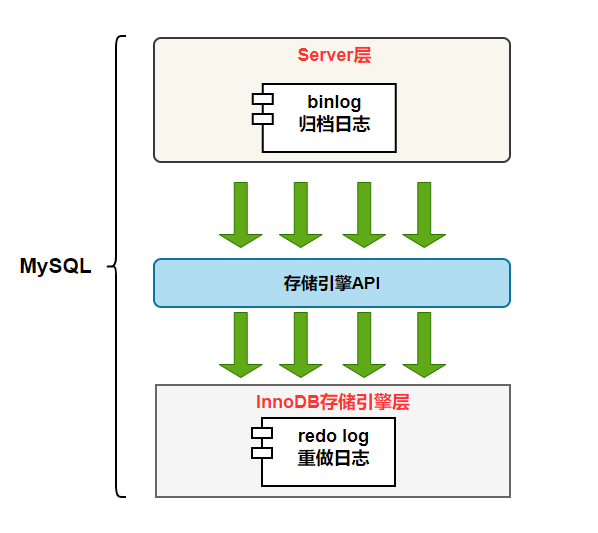

### redo log

`redo log`（重做日志）是`InnoDB`存储引擎独有的，它让`MySQL`拥有了崩溃恢复能力

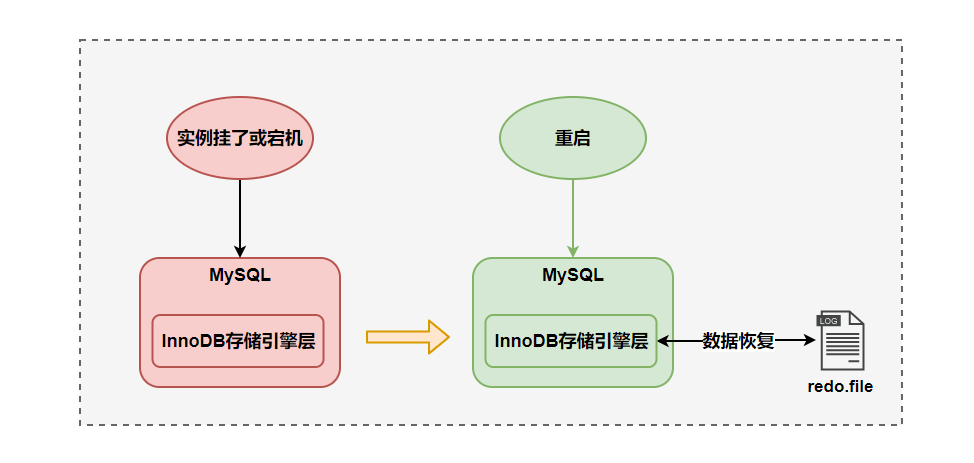

mysql 中的数据是以页为单位，查询数据会先硬盘中的数据加载出来，加载出来的数据叫数据页，会缓存到 `Buffer Pool`中

后续的查询会先在 `Buffer Pool` 中查询，不命中在去硬盘中查询，更新数据的时候也会先更新`Buffer Pool`中的数据，然后会把更新记录重做到日志缓存 `redo log buffer`，接着刷盘到`redo log`文件中

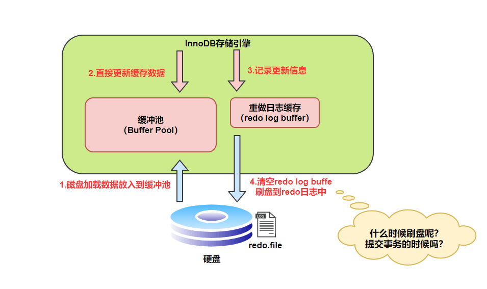

`InnoDB` 存储引擎为 `redo log` 的刷盘策略提供了 `innodb_flush_log_at_trx_commit` 参数，它支持三种策略：

- **0** ：设置为 0 的时候，表示每次事务提交时不进行刷盘操作
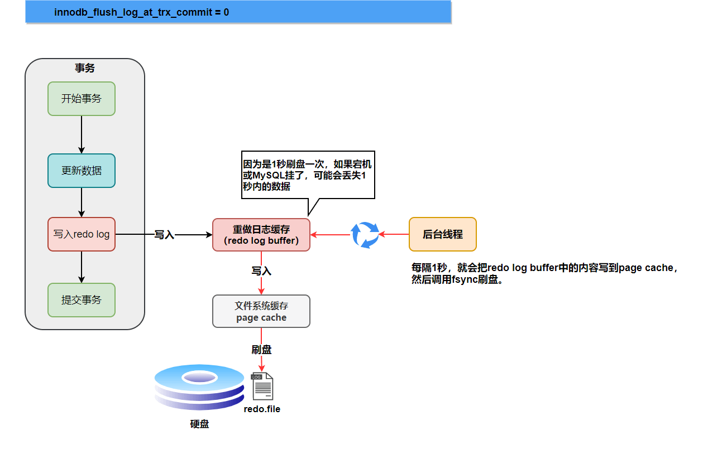
- **1** ：设置为 1 的时候，表示每次事务提交时都将进行刷盘操作（默认值）
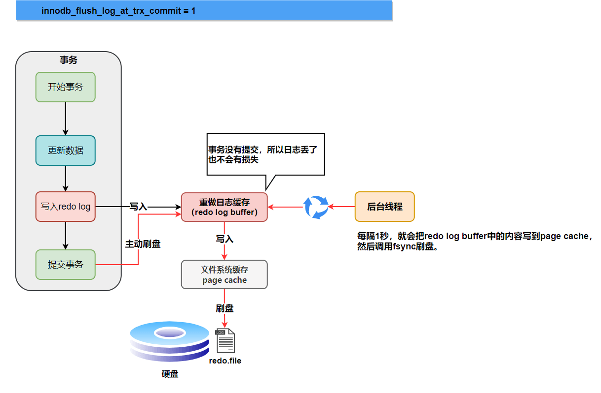
- **2** ：设置为 2 的时候，表示每次事务提交时都只把 redo log buffer 内容写入 page cache
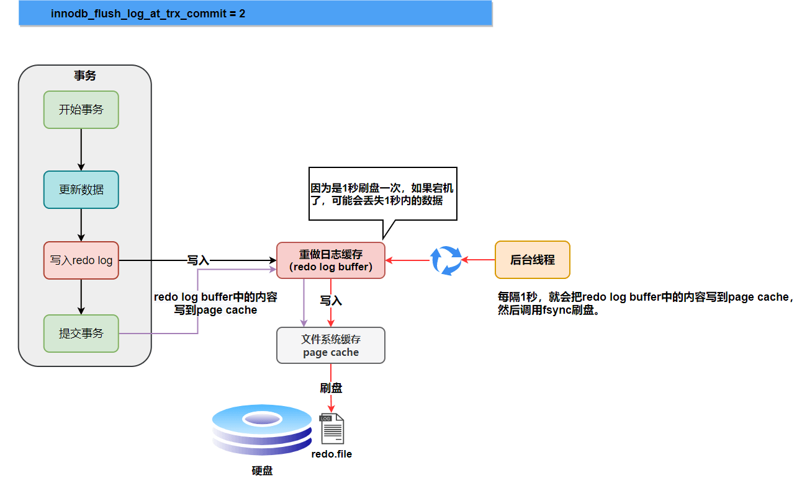

### binlog

`binlog` 是逻辑日志，记录内容是语句的原始逻辑，不管用什么存储引擎，只要发生了表数据更新，都会产生 `binlog` 日志

### 用途

- 数据恢复
- 主从复制

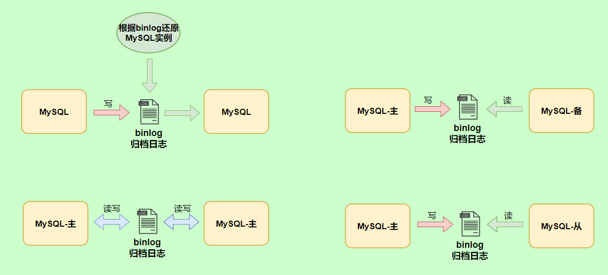

### 记录格式

`binlog` 日志有三种格式，可以通过`binlog_format`参数指定

#### statement

指定`statement`，记录的内容是`SQL`语句原文

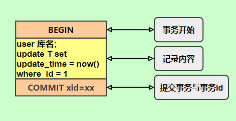

#### row

同步数据时，会执行记录的`SQL`语句，但是有个问题，`update_time=now()`这里会获取当前系统时间，直接执行会导致与原库的数据不一致

为了解决这种问题，我们需要指定为`row`，记录的内容不再是简单的`SQL`语句了，还包含操作的具体数据，记录内容如下

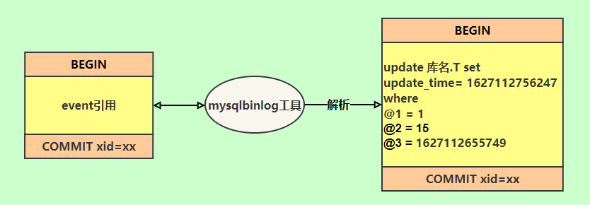

`update_time=now()`变成了具体的时间`update_time=1627112756247`，条件后面的@1、@2、@3 都是该行数据第 1 个~3 个字段的原始值

这样就能保证同步数据的一致性，通常情况下都是指定为`row`，这样可以为数据库的恢复与同步带来更好的可靠性

但是这种格式，需要更大的容量来记录，比较占用空间，恢复与同步时会更消耗`IO`资源，影响执行速度

#### mixed

折中的方案，指定为`mixed`，记录的内容是前两者的混合

`MySQL`会判断这条`SQL`语句是否可能引起数据不一致，如果是，就用`row`格式，否则就用`statement`格式

### 写入机制

`binlog`的写入时机也非常简单，事务执行过程中，先把日志写到`binlog cache`，事务提交的时候，再把`binlog cache`写到`binlog`文件中。

因为一个事务的`binlog`不能被拆开，无论这个事务多大，也要确保一次性写入，所以系统会给每个线程分配一个块内存作为`binlog cache`。

我们可以通过`binlog_cache_size`参数控制单个线程 binlog cache 大小，如果存储内容超过了这个参数，就要暂存到磁盘

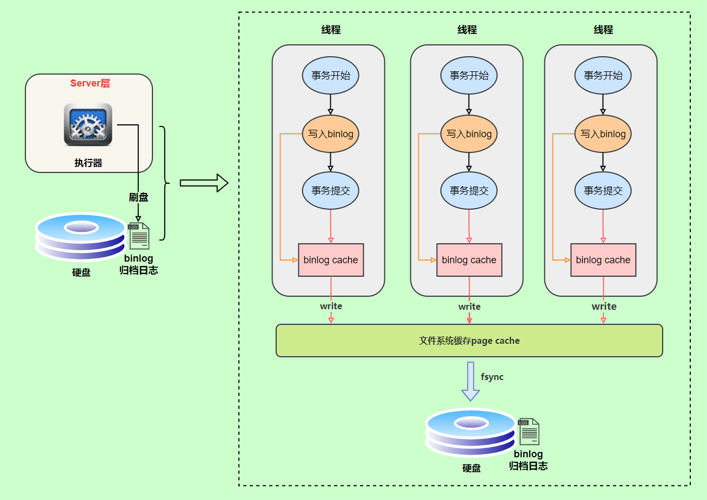

`write`和`fsync`的时机，可以由参数`sync_binlog`控制，默认是`0`

为`0`的时候，表示每次提交事务都只`write`，由系统自行判断什么时候执行`fsync`

可以设置为`1`，表示每次提交事务都会执行`fsync`

最后还有一种折中方式，可以设置为`N(N>1)`，表示每次提交事务都`write`，但累积`N`个事务后才`fsync`

### undo log

我们知道如果想要保证事务的原子性，就需要在异常发生时，对已经执行的操作进行**回滚**，在 MySQL 中，恢复机制是通过 **回滚日志（undo log）** 实现的，所有事务进行的修改都会先记录到这个回滚日志中，然后再执行相关的操作。如果执行过程中遇到异常的话，我们直接利用 **回滚日志** 中的信息将数据回滚到修改之前的样子即可！并且，回滚日志会先于数据持久化到磁盘上。这样就保证了即使遇到数据库突然宕机等情况，当用户再次启动数据库的时候，数据库还能够通过查询回滚日志来回滚将之前未完成的事务

## 事务隔离

SQL 标准定义了四个隔离级别：

- **READ-UNCOMMITTED(读取未提交)** ： 最低的隔离级别，允许读取尚未提交的数据变更，可能会导致脏读、幻读或不可重复读。
- **READ-COMMITTED(读取已提交)** ： 允许读取并发事务已经提交的数据，可以阻止脏读，但是幻读或不可重复读仍有可能发生。
- **REPEATABLE-READ(可重复读)** ： 对同一字段的多次读取结果都是一致的，除非数据是被本身事务自己所修改，可以阻止脏读和不可重复读，但幻读仍有可能发生。
- **SERIALIZABLE(可串行化)** ： 最高的隔离级别，完全服从 ACID 的隔离级别。所有的事务依次逐个执行，这样事务之间就完全不可能产生干扰，也就是说，该级别可以防止脏读、不可重复读以及幻读。

## 执行过程

- **连接器：** 身份认证和权限相关(登录 MySQL 的时候)。
- **查询缓存：** 执行查询语句的时候，会先查询缓存（MySQL 8.0 版本后移除，因为这个功能不太实用）。
- **分析器：** 没有命中缓存的话，SQL 语句就会经过分析器，分析器说白了就是要先看你的 SQL 语句要干嘛，再检查你的 SQL 语句语法是否正确。
- **优化器：** 按照 MySQL 认为最优的方案去执行。
- **执行器：** 执行语句，然后从存储引擎返回数据。 -

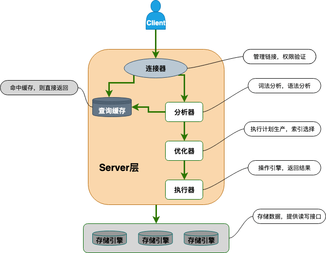

简单来说 MySQL 主要分为 Server 层和存储引擎层：

- **Server 层**：主要包括连接器、查询缓存、分析器、优化器、执行器等，所有跨存储引擎的功能都在这一层实现，比如存储过程、触发器、视图，函数等，还有一个通用的日志模块 binlog 日志模块。
- **存储引擎**： 主要负责数据的存储和读取，采用可以替换的插件式架构，支持 InnoDB、MyISAM、Memory 等多个存储引擎，其中 InnoDB 引擎有自有的日志模块 redolog 模块。**现在最常用的存储引擎是 InnoDB，它从 MySQL 5.5 版本开始就被当做默认存储引擎了。**
