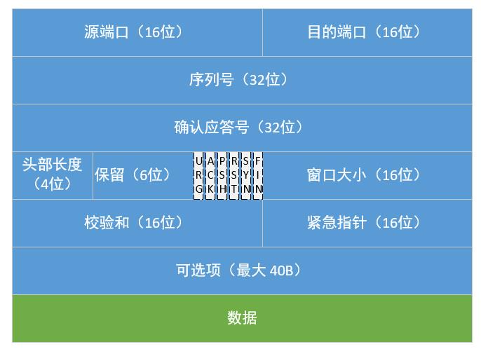

# 网络

## 网络理论

### OSI七层模型

七层分别是应用层、会话层、传输层、网络层、链路层、物理层，简化后的是应用层、传输层、网络层、数据链路层

### TCP协议

TCP是一种面向连接的、可靠的、基于字节流的传输层通信协议，TCP通过序号和确认消息确保消息的可靠性，通过数据重传确保消息的完整性

### UDP协议

UDP是一种无状态的不可靠的简单传输层协议

### HTTP

工作在应用层的超文本传输协议

### HTTP 1.1

基于文本、支持缓存、支持长连接、Host头处理：支持虚拟主机

### HTTP 2.0

二进制传输、头部压缩、多路复用和服务器推送

## TCP特性

### TCP三次握手

- 第一次握手：  
客户端发送一个SYN包给服务器，请求与服务器建立连接  
- 第二次握手：  
服务器收到客户端的SYN包后会发给客户端一个SYN包和ACK的确认消息，是告诉客户端可以建立连接我准备好了你准备好了吗  
- 第三次握手：  
客户端收到服务端的SYN包和ACK之后会发一个ACK的确认消息，此时三次握手完成里连接状态是ESTABLISHED

### TCP四次挥手

- 第一次挥手  
主动关闭方发送一个FIN+ACK报文，此时主动方进入FIN_WAIT1状态，主动方停止发送数据但仍然能接收数据  
- 第二次挥手  
被动方收到FIN+ACK，发送一个ACK给对方，此时被动方进入CLOSE-WAIT状态，被动方仍然可以给主动方发送数据  
- 第三次挥手  
主动方收到ACK后，此时主动方进入FIN_WAIT2状态，被动方确定没有数据要发后就会发送FIN+ACK报文  
- 第四次挥手  
主动方收到FIN+ACK，此时主动方进入TIME-WAIT状态，发送一个ACK给被动方，方被动方进入CLOSED状态

### TCP头部格式



- 序列号  
在建⽴连接时由计算机⽣成的随机数作为其初始值，通过 SYN 包传给接收端主机，每发送⼀次数据，就累加⼀次该数据字节数的⼤⼩。⽤来解决⽹络包乱序问题
- 确认应答号  
指下⼀次期望收到的数据的序列号，发送端收到这个确认应答以后可以认为在这个序号以前的数据都已经被正常接收。⽤来解决不丢包的问题
- 保留控制位，初始值为 0  ，当为1时表示：  
`URG`: 紧急指针有效  
`ACK`: 确认序号有效  
`PSH`: 接收方应尽快将这个报文交给应用层  
`RST`: 连接重置  
`SYN`: 同步序号用来发起一个连接  
`FIN`: 终止一个连接  

### TCP重传机制

TCP要保证所有的数据都可以到达，所以必需要有重传机制

- 快速重传  
正常情况下发送端发送一组数据1、2、3、4、5，正常情况下接收端收到5个数据会发送一个ack6的确认消息  
发送过程中如果接收端收到了1、2没有收到3接收端回复ack3, 即使已经收到了1、2、4、5也会回复ack3，此时发送端需要重传3，接收端收到3后会回复6

- 超时重传  
在发送消息时，设定一个定时器，当超过指定的时间后，没有收到对方的ack报文，就会重发该数据  
RTT是指数据传输需要的时间，RTO是超时重传时间，RTO是根据RTT的时间动态计算的

- SACK选择性确认  
TCP 头部「选项」字段里加一个 SACK，它可以将缓存区的地图发给发送方，发送方就知道了要重传哪些信息

不过该重传机制需要操作系统支持

### TCP滑动窗口

本来TCP每发送一个数据，都要进行一次确认应答，这样效率显然很低  
TCP为了解决这个问题引入了窗口的概念，窗口需要指定大小，这个大小就是无需应答可以继续发送数据的最大值

窗口实际上是操作系统开辟的一块缓冲区，在收到接收方的确认消息之前，已发送的数据必须存在缓存区，有丢失可以直接从缓存区重发数据，收确认消息则可以清除缓存区  
TCP头部有个叫Windows的字段就是窗口的大小（单位=字节），通常情况下窗口的大小是由接收端的缓存区大小来决定的

发送方滑动窗口：

- 1（1-30）已发送并收到ACK确认的数据
- 2（31-40）已发送还没有收到ACK确认的数据
- 3（41-50）未发送大小在接收方可处理的范围内
- 4（51-...）未发送大小超出接收方可处理的范围内

`SND.WND = 窗口的大小(假设=20字节，由接收方设定)`

`SND.UNA = #2的第一个序号也就是31`

`SND.NXT = #3的第一个序号也就是41`

`可用窗口大小 = SND.WND - (SND.NXT - SND.UNA)`

`那么可用窗口大小=10`

接收方滑动窗口：

- 1 + 2是已成功接收并确认的数据（等待应用程序读取）
- 3 可以接收数据但比并未接收数据
- 4 不可用接收数据

`RCV.WND = 可用窗口大小，需要通知给发送方`

`RCV.NXT = 期望发送的下一个数据的序列号，也就是#3的第一个字节`

`#4的第一个字节 = RCV.NXT + RCV.WND`

### TCP流量控制

TCP发送需要考虑接收方的处理能力，不然会造成接收方无法处理造成大量重传  
TCP提供一种机制可以让发送方根据接收方的缓存实际接收能力控制发送的数据量，这就是流量控制

流控的手段：

- 滑动窗口的过程就是流控的过程
- 操作系统会根据情况动态调整缓存区的大小

### TCP拥塞控制

流量控制是避免填满接收方缓存，当网络发送拥堵时就要有拥塞控制避免进一步加重网络拥堵  
要实现拥塞控制需要定义一个拥塞窗口，拥塞窗口C.WND是发送方维护的一个的状态变量，它会根据网络的拥塞程度动态变化，只要发送方没有在规定的时间收到接收方ACK应答发生超时重传，就会认为网络发生拥塞

`SND.WND = min(C.WND, R.WND)`

拥塞控制主要是四个算法：

- 慢启动  
建立连接完成后，TCP不会马上发送大量数据，C.WND会线性增长直到= ssthresh（慢启动门上限）
- 拥塞避免  
每收到ssthresh值/8个ACK，C.WND + 1
- 拥塞发生  
`超时重传` 则进入拥塞算法，ssthresh重置为C.WND/2，C.WND重置为1  
`快速重传` 发送方收到3个重传ACK，发送方不比等超时就可以重传丢失的数据，ssthresh=C.WND C.WND=C.WND/2

- 快速重传
快速重传发生后一般会进入快速恢复，C.WND = ssthresh + 3

## HTTP特性

### HTTP状态码

- 1xx：属于提示信息，是协议处理中的一种中间状态，实际用到的比较少
- 2xx：服务成功处理了请求
- 3xx：请求资源发生了变化，需要客户端请求新的URL
- 4xx：客户端请求的资源有错误
- 5xx：服务器有错误

### HTTP常见字段

- `Host`：客户端发送请求时，用来指定服务器的域名
- `Content-Length`：服务器在返回数据的长度
- `Connection`：表示客户端希望建立一个TCP长连接
- `Content-Type`：可以声明客户端发送给服务端的数据编码和格式，也可以用于服务器返回数据

### HTTP请求方法

- GET：客户端从服务端获取资源
- POST：向服务端指定的资源提交数据
- PUT：向服务端指定的资源更新数据
- DELETE：顾名思义，删除服务端指定的资源

### HTTP报文格式

HTTP 基本的报文格式就是 header + body

- header：key-value格式
- body：支持多种格式，比如Text、JSON

### HTTP状态

HTTP协议服务端不记录客户端的状态，一般会把状态信息写入Cookie

### HTTPS加密

 由于HTTP是明文的很不安全，攻击者可能会窃听数据、篡改数据和冒充身份  
HTTPS通过SSL/TLS协议加密HTTP报文，解决了上述的三个问题

- 数据加密：加密传输数据，攻击者即使窃取到数据也无法看到真实的内容
- 摘要加密：在数据加入摘要信息，摘要为数据生成了唯一指纹，攻击者一旦修改了数据就会被发现
- 身份验证：由权威机构颁发一个数字证书，证明服务器的身份

### TLS握手过程

- 第⼀次握⼿
客户端发送 `Client Hello` 消息，消息包含客户端的TLS版本、支持的密码套件（密钥交换算法 + 签名算法 + 对称加密算法 + 摘要算法），还会生成一个客户端随机数 `Client Random`
- 第二次握手
服务端接到 `Client Hello` 消息，查看TLS版本、密码套件是否支持。服务端选择一个密码套件列表中选择一个密码套件，生成一个`服务端随机数`
接下来服务端发送 `Server Hello` 消息，消息包含确定好的TLS版本、密码套件和服务端随机数 `Server Random`  
随后服务端发送自己的 `Server Certificate` 消息，消息中农包含能证明服务端身份的数字证书  
最后服务端发送 `Server Hello Done` 消息，告诉客户端消息发送完毕
- 第三次握手
客户端通过本地CA验证服务端证书是否可信，验证通过继续  
客户端就会⽣成⼀个新的随机数 `pre-master`，⽤服务器的RSA公钥加密该随机数，通过 `Change Cipher Key Exchange` 消息传给服务端  
⾄此，客户端和服务端双⽅都共享了三个随机数，分别是 Client Random、Server Random、pre-master  
于是，双⽅根据已经得到的三个随机数，⽣成会话密钥 `Master Secret`，它是对称密钥，⽤于对后续的HTTP请求/响应的数据加解密  
⽣成完会话密钥后，然后客户端发⼀个 `Change Cipher Spec` ，告诉服务端开始使⽤加密⽅式发送消息
- 第四次握手
服务器也是同样的操作，发送 `Change Cipher Spec` 和 `Encrypted Handshake Message` 消息，如果双⽅都验证加密和解密没问题，那么握⼿正式完成

## 网络编程

### WebSocket

WebSocket基于HTTP的端口，提供TCP连接进行双向通讯的机制，以取代HTTP只能客户端轮询的单向机制

### Socket

Socket是对TCP/IP协议的封装，应用程序直接调用Socket进行网络通信不用处理TCP/IP协议复杂的细节

### RPC

RPC即远程过程调用，RPC实际上不是标准的网络协议，通常RPC有以下特征

- 需要事先约定调用的语义
- 通过网络调用
- 需要约定网络传输中的内容格式

### Socket粘包和半包

粘包问题是指当发送两条消息时，比如发送了 ABC 和 DEF，但另一端接收到的却是 ABCD，像这种一次性读取了两条数据的情况就叫做粘包（正常情况应该是一条一条读取的）  
半包问题是指，当发送的消息是 ABC 时，另一端却接收到的是 AB 和 C 两条信息，像这种情况就叫做半包

值得注意的是UDP没有粘包和半包的现象，UDP保护消息边界不会分割消息每个消息都是独立的

### Socket粘包的主要原因

- 发送方每次写入数据 < Socket缓冲区大小
- 接收方读取套接字Socket缓冲区数据不够及时

缓冲区又称为缓存，它是内存空间预留的储空间用来缓冲输入或输出的数据，如果没有缓存区CPU直接读写磁盘那会很慢`

### Socket半包的主要原因

- 发送方每次写入数据  Socket缓冲区大小

所谓的TCP粘包是一个伪概念，TCP本身就是一个无边际基于流的协议，应用层协议需要根据TCP的特性去合理的做数据封装，比如规定报文的长度、头部消息、结尾消息

## Linux包过滤防火墙

### Netfilter

netfilter是内核中的一个包过滤处理模块，有以下功能：

- 网络地址转换NAT
- 数据包内容修改
- 数据包过滤的防火墙功能

### Iptables

iptables 是用户态的一个工具，它负责配置netfilter的表链规则

### Netfilter的五个链

- INPUT链  
数据包入站本机时，应用此链中的规则
- OUTPUT链  
数据包从本机出站时，应用此链中的规则
- FORWARD链  
数据包通过本机转发时，应用此链中的规则
- PREROUTING链  
数据包作路由选择前，应用此链中的规则
- POSTROUTING链  
数据包作路由选择后，应用此链中的规则

### Netfilter的四张表

- filter表  
过滤数据包，包含INPUT链、OUTPUT链、FORWARD链
- nat表  
进行NAT转换，包含INPUT链、OUTPUT链、PREROUTING链、POSTROUTING链
- mangle表  
修改数据包的服务类型、TTL，设置Mark标记，实现QOS和策略路由，包含INPUT链、OUTPUT链、PREROUTING链、POSTROUTING链
- raw表  
决定数据包是否被状态跟踪机制处理，包含OUTPUT链、PREROUTING链

#### raw表的状态

- NEW  
该包想新建一个连接
- RELATED  
该包是属于某个已经建立的连接所建立的新连接
- ESTABLISHED  
匹配状态为ESTABLISHED的数据包
- INVALID  
该包不能被识别属于任何连接或没有任何状态

### iptables常用命令

```shell
iptables -P INPUT DROP  
# 默认拒绝所有进入本机的流量

iptables -A INPUT --dport 22 -j ACCEPT  
# 允许访问本机SSH服务
  
iptables -I INPUT 1 -s 192.168.1.0/24 --dport 22 -j DROP  
# 拒绝192.168.1.0/24访问本机SSH服务并插入到第一行  

iptables -A INPUT -m state --state ESTABLISHED,RELATED -j ACCEPT  
# 防止本机主动发出的流量，回到本机时被拒绝

iptables -t nat -A POSTROUTING -o eth0 -j MASQUERADE --to 192.168.1.1  
# 把所有从eth0网卡路由出去的流量源地址伪装成192.168.1.1  

iptables -t nat -A PREROUTING -d 192.168.1.1 -p tcp --dport 80 -j DNAT --to-destination 192.168.1.2:8080  
# 把访问192.168.1.1:80的流量转发到192.168.1.2:8080  

iptables -t nat -A PREROUTING -p udp --dport 53 -j REDIRECT --to-ports 53  
# 劫持dns流量丢入本机的53端口处理  
```
