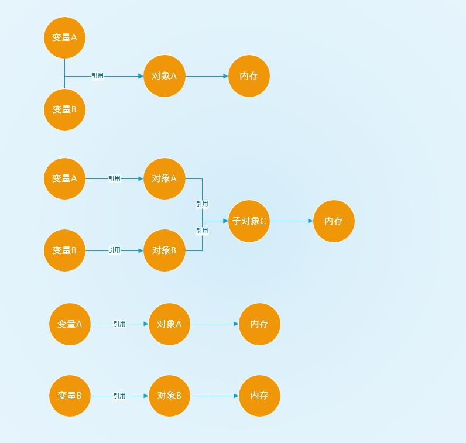

# Python

## 数据类型

- 数字 `(int float bool complex)`  
不可修改
- 字符串 `(sring)`  
不可修改
- 列表 `(list)`  
可以包含0个或多个元素，元素可以是任意数据类型。可修改
- 元祖 `(tuple)`  
元组与列表相似。不可修改
- 字典 `(dict)`
字典由0个或多个键值 `(key=value)` 组成，键值可以是任意数据类型。可修改
- 集合 `(set)`  
集合是一个无序的不重复元素序列。可修改

## 基础语法

### 声明变量

```python
# 字符串
x_str = "哈哈哈"

# 数字
x_number = 123

# 列表
x_list = [1, 2, "哈哈哈"]

# 元祖
x_tuple = (1, 2, "哈哈哈")

# 字典
x_dict = {"name": "三木", "age": 18}

# 集合
x_set = {"苹果", "香蕉", "苹果"}
```

### 操作列表

```python
x_list = [1, 2, 3]

# 修改列表元素
x_list[0] = 1

# 删除列表元素
del x_list[0]

# 扩容列表元素
x_list.append(1)

# 测量列表长度
len(x_list)
```

### 操作字典

```python
x_dict = {"name": "三木", "age": 18}

# 修改字典值
x_dict["age"] = 20

# 删除字典键
del x_dict["age"]

# 为字典增加键值
type_map["post"] = "工程师"
```

### 定义函数

```python
def func_a(x):
    print("x=%s" % x)


# 声明类型
def func_b(x: int) -> int:
    print("x=%s" % x)
    return x
```

### 可变参数

`*args` 是一个可变参数容器，允许传入0-任意参数，这些参数在函数调用时组成一个元组  
`**kwargs` 是一个可变参数容器，允许传入-任意带参数名的参数，这些参数在函数调用时组成一个字典  
`*args **kwargs` 一起使用时 `*args` 必须在前面

```python
def func_c(x, *args, **kwargs):
    print("x=%s" % x)


func_c(3, [1, 2, 3], *[1, 2, 3], name="三木", age=20)
```

### 流程控制

```python
x = 6

if x < 10:
    print("x小于10")
elif x > 8:
    print("x大于8")
else:
    print("x既不小于10也不大于8")
```

### 循环语句

```python
# 循环100次
for i in range(1, 100):
    print(i)

# 遍历数组，还可以遍历字典、元组、集合
for i in x_list:
    print(i)

# 无限循环
var = 1
while var == 1 :
   num = int(input("输入一个数字："))
   print ("你输入的数字是：", num) 
```

### 异常处理

```python
# -*- coding: utf-8 -*-

while True:
    try:
        x = int(input("请输入一个数字："))
    except ValueError:
        print("输入错误！！！")
    else:
        print("输入正确，你输入的数字是：", x) 
```

```python
# -*- coding: utf-8 -*-

while True:
    try:
        x = int(input("请输入一个数字："))
    except OSError as err:
        print("输入错误！！！ 请看报错", err)
    else:
        print("输入正确，你输入的数字是：", x)
        break
```

## 面向对象

### 创建类

```python
# -*- coding: utf-8 -*-
# @preson/__init__.py

class Person:
    # 定义基本属性
    __occupation = "无业"  # 私有属性，外部无法访问
    name = ""
    age = 0
    iq = 0

    # 定义构造方法
    def __init__(self, name, age, iq):
        self.name = name
        self.age = age
        self.iq = iq
        self.__occupation

    # 类方法
    def make_id(self):
        print("|职业：%s|\n|姓名：%s|\n|年龄：%d|\n|智商：%d|\n" % (self.__occupation, self.name, self.age, self.iq))


# 继承Person类
class Student(Person):
    occupation = "学生"
    grade = 0

    def __init__(self, name, age, iq, grade):
        # 调用父类的构造方法
        Person.__init__(self, name, age, iq)
        self.grade = grade

    # 私有类方法
    def __check_iq(self):
        if self.iq < 50:
            print("警告：该学生智商太低\n")

    # 重写父类方法
    def make_id(self):
        print("|职业：%s|\n|姓名：%s|\n|年龄：%d|\n|智商：%d|\n|年级：%d|\n" % (self.occupation, self.name, self.age, self.iq, self.grade))
        self.__check_iq()


class Teacher(Person):
    occupation = "老师"
    teach = ""

    def __init__(self, name, age, iq, teach):
        Person.__init__(self, name, age, iq)
        self.teach = teach

    def make_id(self):
        print("|职业：%s|\n|姓名：%s|\n|年龄：%d|\n|智商：%d|\n|教课：%s|\n" % (self.occupation, self.name, self.age, self.iq, self.teach))
```

### 调用类

```python
# -*- coding: utf-8 -*-
import person

# 生成人类身份证
p = person.Person(name="张三", age=20, iq=100)
p.make_id()

# 生成学习身份证
s = person.Student(name="李四", age=16, iq=0, grade=6)
s.make_id()

# 生成老师身份证
t = person.Teacher(name="王五", age=32, iq=120, teach="语文")
t.make_id()
```

## Python 各种器

### 迭代器和生成器

迭代器是一个可以记住遍历的位置的对象  
迭代器对象从集合的第一个元素开始访问，直到所有的元素被访问完结束  
迭代器只能往前不会后退  
字符串，列表或元组对象都可用于创建迭代器

```python
# -*- coding: utf-8 -*-
import sys

data_list = [1, 2, 3]

# 创建迭代器
it = iter(data_list)

for x in it:
    print(x)
    if x == 2:
        print("迭代器不用全部读取 如果到2停止就能节省内存")
        break


def fibonacci(n):  # 生成器函数 斐波那契
    a, b, counter = 0, 1, 0
    while True:
        if (counter > n):
            return
        yield a
        a, b = b, a + b
        counter += 1


f = fibonacci(10)  # f 是一个迭代器，由生成器返回生成

while True:
    try:
        print(next(f), end=" ")
    except StopIteration:
        sys.exit()

```

### 装饰器

装饰器是可以修改其它函数的功能的函数，装饰器不要求修改其它函数本身  

```python
# -*- coding: utf-8 -*-

# 不带参数的装饰器
def prefix(func):
    def wrapper(*args, **kwargs):
        print("我是不带参数装饰器，我会在你前面打印", end=' ')
        return func(*args, **kwargs)
    return wrapper


@prefix
def test_a(x):
    return x


def custom_prefix(value):
    def decorator(func):
        def wrapper(*args, **kwargs):
            print(value)
            return func(*args, **kwargs)
        return wrapper
    return decorator


@custom_prefix("我是带参数装饰器，我会打印在上一行")
def test_b(x):
    return x


print(test_a(100))
print(test_b(200))
```

## Python内存管理

### 变量与对象

- 变量  
变量是一个名称
- 对象  
类型已知，每个对象都包含一个头部信息，类型标识符和引用计数器

类型标识符：变量没有类型，变量引用对象，对象是什么类型的变量就是什么类型的  
引用计数器：每当有变量引用对象，那么引用计数器+1

### 垃圾回收

- 回收原理  
某个对象的引用计数降为0时，对象没有被使用，该对象就是可以被回收的对象
- 回收时机  
Python在GC的时候不能执行其它任务，频繁GC势必严重影响性能，所以回收的时机很重要  
Python会先标记需要GC的对象，当标记数量达到阀值的时候在统一执行GC

### 对象拷贝

- 对象引用  
- 独立对象，相同子对象  
- 独立对象



```python
# -*- coding: utf-8 -*-
import copy

# 注意不可变对象无论如何拷贝都是复制一个新的内存对象，所以只有可变对象的拷贝才有不同的含义
# 可变数据类型：列表list、字典dict
# 不可变数据类型：整型int、浮点型float、字符串string、元组tuple


# b是a对象的引用,a,b指向同一个对象
a = {1: [1, 2, 3]}
b = a
a[1][0] = 999
print("a=%s b=%s" % (a, b))

# a 和 b 是一个独立的对象，但他们的子对象[1, 2, 3]还是指向同一个对象
a2 = {1: [1, 2, 3]}
b2 = a2.copy()
a2[1][0] = 999
print("a=%s b=%s" % (a2, b2))

# 深度拷贝, a 和 b 完全拷贝了父对象及其子对象，两者是完全独立的
a3 = {1: [1, 2, 3]}
b3 = copy.deepcopy(a3)
a3[1][0] = 999
print("a=%s b=%s" % (a3, b3))
```

## Python多线程

### 线程模块

Python3 通过标准库 `threading` 提供对线程的支持

```python
# -*- coding: utf-8 -*-
import threading

balance = 10
lock = threading.Lock()


def run_thread(name, charged):
    lock.acquire()  #加锁
    global balance
    if balance < charged:
        print("启动线程%s 手续费扣除失败余额不足%s" % (name, balance))
    else:
        balance = balance - charged
        print("启动线程%s 余额等于=%s" % (name, balance))
    lock.release()  #释放锁


for i in range(5):
    t = threading.Thread(target=run_thread, args=("线程" + str(i + 1), 3,))
    t.start()
```

控制台输出：

```bash
启动线程线程1 余额等于=7
启动线程线程2 余额等于=4
启动线程线程3 余额等于=1
启动线程线程4 手续费扣除失败余额不足1
启动线程线程5 手续费扣除失败余额不足1
```

继承线程类：

```python
# -*- coding: utf-8 -*-
import threading

class MyThread(threading.Thread):
    # 必须重写run方法
    def run(self):
        print("我是线程：" + self.name)


for i in range(5):
    t = MyThread()
    t.start()
```

控制台输出：

```bash
我是线程：Thread-1
我是线程：Thread-2
我是线程：Thread-3
我是线程：Thread-4
我是线程：Thread-5
```

### 全局解释器锁

全局解释器锁简称 `CIL` ，每个线程在执行时候都需要先获取GIL，CIL同时只能被一个线程占用  
CIL释放的条件：

- 占用CIL的线程执行完毕
- 占用CIL的线程被阻塞（如I/O等待）
