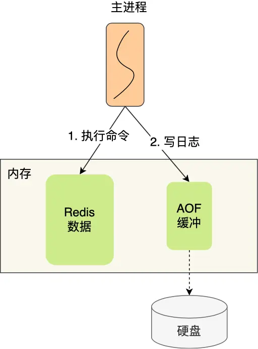

# Redis

## 数据类型

### String

String 是最基本的 key-value 结构，key 是唯一标识，value 是具体的值，value其实不仅是字符串， 也可以是数字（整数或浮点数），value 最多可以容纳的数据长度是 `512M`。

### List

List 列表是简单的字符串列表，按照插入顺序排序，可以从头部或尾部向 List 列表添加元素

### Hash

Hash 是一个键值对（key - value）集合

### Set

Set 类型是一个无序并唯一的键值集合，它的存储顺序不会按照插入的先后顺序进行存储

### Zset

Zset 类型（有序集合类型）相比于 Set 类型多了一个排序属性 score（分值），对于有序集合 ZSet 来说，每个存储元素相当于有两个值组成的，一个是有序集合的元素值，一个是排序值

## 持久化

### AOF 持久化

Redis 会把每次的写命令执行成功后，以文本的形式追加写入到AOF缓存，在合适的时机把缓存写入AOF文件

- Always 每次写命令执行完成后同步写入硬盘
- Everysec 每秒将缓存写入硬盘
- No 由操作系统控制

### AOF 重写

随着写命令越来越多AOF文件也会越来越大，单个键可能会有多个记录，数据恢复就会有额外的开销，当AOF文件达到一定大小是就要对AOF文件进行重写

Redis 通过后台子进程完成重写的操作，子进程读取所有键值，并为每个键值生成一个命令写入新的AOF文件，然后在替换掉老的AOF文件

### RDB 快照

Redis 可以手动或自动把当前内存中的全量数据保存到硬盘文件

- `save` ，保存RDB文件期间会阻塞主线程
- `bsabe`， 会创建子进程保存RDB文件，通过`fork()`创建子进程，子进程可以和父进程共享同一片的内存数据，只有块数据发生变化时物理内存才会发生复制，所以`bsabe`保存RDB文件时不会阻塞主线程

## 主从复制

主从服务器间的第一次同步的过程可分为三个阶段：

- 第一阶段是建立链接、协商同步
- 第二阶段是主服务器同步数据给从服务器
- 第三阶段是主服务器发送新写操作命令给从服务器

### 首次同步

#### 第一阶段协商同步

执行了 replicaof 命令后，从服务器就会给主服务器发送 `psync` 命令，表示要进行数据同步

主服务器收到 psync 命令后，会用 `FULLRESYNC` 作为响应命令返回给对方

#### 第二阶段：主服务器同步数据给从服务器

主服务器会执行 bgsave 命令来生成 RDB 文件，然后把文件发送给从服务器

从服务器收到 RDB 文件后，会先清空当前的数据，然后载入 RDB 文件

那么为了保证主从服务器的数据一致性，在第一次同步期间主服务器收到的写操作命令，写入到 replication buffer 缓冲区里

#### 第三阶段：主服务器发送新写操作命令给从服务器

主服务器将 replication buffer 缓冲区里所记录的写操作命令发送给从服务器

### 主服务器性能

首次同步时主服务会执行 bgsave 命令来生成 RDB 文件，当从服务器数量很多时无疑很影响主服务器的性能，这时只需要在执行`replicaof`  时把主服务器改成从服务器

### 增量同步

首次同步后，主服务器和从服务器之间会建立一个长连接进行命令广播

#### 故障恢复

在主服务器进行命令传播时，不仅会将写命令发送给从服务器，还会将写命令写入到 `repl_backlog_buffer` 缓冲区里，因此这个缓冲区里会保存着最近传播的写命令

`replication offset`标记上面那个缓冲区的同步进度，主从服务器都有各自的偏移量，主服务器使用 master_repl_offset 来记录自己「_写_」到的位置，从服务器使用 `slave_repl_offset` 来记录自己「_读_」到的位置

- 从服务器在恢复网络后，会发送 psync 命令给主服务器，此时的 `psync` 命令里的 `offset`参数不是 -1
- 主服务器收到该命令后，然后用 `CONTINUE` 响应命令告诉从服务器接下来采用增量复制的方式同步数据
- 然后主服务将主从服务器断线期间，所执行的写命令发送给从服务器，然后从服务器执行这些命令

#### 同步方式

- 如果判断出从服务器要读取的数据还在 `repl_backlog_buffer` 缓冲区里，那么主服务器将采用增量同步的方式
- 相反，如果判断出从服务器要读取的数据已经不存在 `repl_backlog_buffer` 缓冲区里，那么主服务器将采用全量同步的方式

## 哨兵模式

哨兵的主用作用是主从故障转移，哨兵会监控所有节点的状态，当主节点宕机后重新选举主节点

### 第一轮投票：判断主节点下线

当哨兵集群中的某个哨兵判定主节点下线（主观下线）后，就会向其他哨兵发起命令，其他哨兵收到这个命令后，就会根据自身和主节点的网络状况，做出赞成投票或者拒绝投票的响应。

当这个哨兵的赞同票数达到哨兵配置文件中的 quorum 配置项设定的值后，这时主节点就会被该哨兵标记为「客观下线」

### 第二轮投票：选出哨兵leader

某个哨兵判定主节点客观下线后，该哨兵就会发起投票，告诉其他哨兵，它想成为 leader，想成为 leader 的哨兵节点，要满足两个条件：

- 第一，拿到半数以上的赞成票；
- 第二，拿到的票数同时还需要大于等于哨兵配置文件中的 quorum 值。

### 由哨兵 leader 进行主从故障转移

选举出了哨兵 leader 后，就可以进行主从故障转移的过程了。该操作包含以下四个步骤：

- 第一步：在已下线主节点（旧主节点）属下的所有「从节点」里面，挑选出一个从节点，并将其转换为主节点，选择的规则：
  - 过滤掉已经离线的从节点
  - 过滤掉历史网络连接状态不好的从节点
  - 将剩下的从节点，进行三轮考察：优先级、复制进度、ID 号。在每一轮考察过程中，如果找到了一个胜出的从节点，就将其作为新主节点
- 第二步：让已下线主节点属下的所有「从节点」修改复制目标，修改为复制「新主节点」
- 第三步：将新主节点的 IP 地址和信息，通过「发布者/订阅者机制」通知给客户端
- 第四步：继续监视旧主节点，当这个旧主节点重新上线时，将它设置为新主节点的从节点
