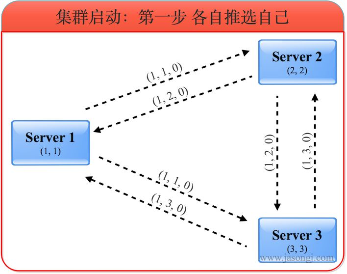

# ZooKeeper

## 服务器角色

- **Leader** 一个ZooKeeper集群同一时间只会有一个实际工作的Leader，它会发起并维护与各Follwer及Observer间的心跳。所有的写操作必须要通过Leader完成再由Leader将写操作广播给其它服务器
- **Follower** 一个ZooKeeper集群可能同时存在多个Follower，它会响应Leader的心跳Follower可直接处理并返回客户端的读请求，同时会将写请求转发给Leader处理，并且负责在Leader处理写请求时对请求进行投票
- **Observer** 角色与Follower类似，但是无投票权


## 原子广播（ZAB）

### 写操作

#### Leader


1. 客户端向Leader发起写请求
2. Leader将写请求以Proposal的形式发给所有Follower并等待ACK
3. Follower收到Leader的Proposal后返回ACK
4. Leader得到过半数的ACK（Leader对自己默认有一个ACK）后向所有的Follower和Observer发送Commmit
5. Leader将处理结果返回给客户端

#### Follower/Observer


- Follower/Observer均可接受写请求，但不能直接处理，而需要将写请求转发给Leader处理
- 除了多了一步请求转发，其它流程与直接写Leader无任何区别

### 读操作

Leader/Follower/Observer都可直接处理读请求，从本地内存中读取数据并返回给客户端即可


## FastLeaderElection 选举算法

### myid

每个ZooKeeper服务器，都需要在数据文件夹下创建一个名为myid的文件，该文件包含整个ZooKeeper集群唯一的ID（整数）。例如，某ZooKeeper集群包含三台服务器，hostname分别为zoo1、zoo2和zoo3，其myid分别为1、2和3，则在配置文件中其ID与hostname必须一一对应，如下所示。在该配置文件中，server.后面的数据即为myid

```shell
server.1=zoo1:2888:3888

server.2=zoo2:2888:3888

server.3=zoo3:2888:3888
```

### 服务器状态

- **LOOKING** 不确定Leader状态。该状态下的服务器认为当前集群中没有Leader，会发起Leader选举
- **FOLLOWING** 跟随者状态。表明当前服务器角色是Follower，并且它知道Leader是谁
- **LEADING** 领导者状态。表明当前服务器角色是Leader，它会维护与Follower间的心跳
- **OBSERVING** 观察者状态。表明当前服务器角色是Observer，与Folower唯一的不同在于不参与选举，也不参与集群写操作时的投票

### 投票

#### 投票给自己

集群刚启动时，所有服务器的logicClock都为1，zxid都为0。各服务器初始化后，都投票给自己，并将自己的一票存入自己的票箱



(1, 1, 0)第一位数代表投出该选票的服务器的logicClock，第二位数代表被推荐的服务器的myid，第三位代表被推荐的服务器的最大的zxid。由于该步骤中所有选票都投给自己，所以第二位的myid即是自己的myid，第三位的zxid即是自己的zxid

#### 更新投票

服务器收到外部投票后，进行选票PK，相应更新自己的选票并广播出去，并将合适的选票存入自己的票箱


服务器1收到服务器2的选票（1, 2, 0）和服务器3的选票（1, 3, 0）后，由于所有的logicClock都相等，所有的zxid都相等，因此根据myid判断应该将自己的选票按照服务器3的选票更新为（1, 3, 0），并将自己的票箱全部清空，再将服务器3的选票与自己的选票存入自己的票箱，接着将自己更新后的选票广播出去。此时服务器1票箱内的选票为(1, 3)，(3, 3)。  
  
同理，服务器2收到服务器3的选票后也将自己的选票更新为（1, 3, 0）并存入票箱然后广播。此时服务器2票箱内的选票为(2, 3)，(3, ,3)。  
  
服务器3根据上述规则，无须更新选票，自身的票箱内选票仍为（3, 3）。  
  
服务器1与服务器2更新后的选票广播出去后，由于三个服务器最新选票都相同，最后三者的票箱内都包含三张投给服务器3的选票。

#### 确定角色

根据上述选票，三个服务器一致认为此时服务器3应该是Leader。因此服务器1和2都进入FOLLOWING状态，而服务器3进入LEADING状态。之后Leader发起并维护与Follower间的心跳


